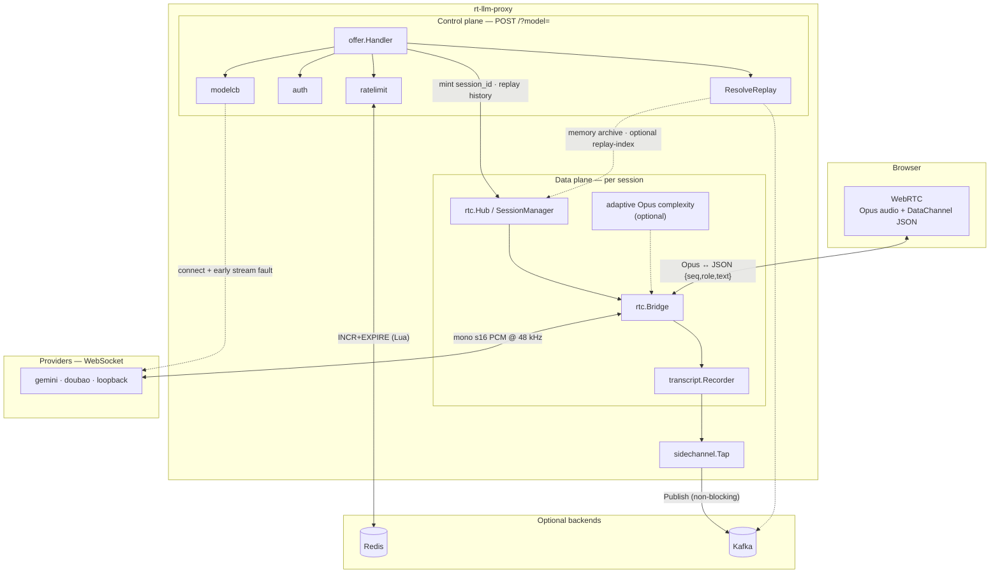
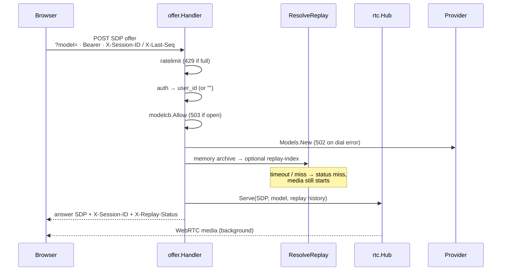
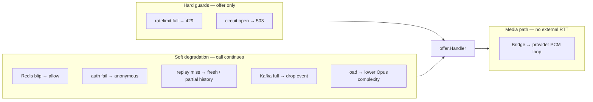

# Architecture & Engineering Notes

How rt-llm-proxy is put together, and **why** each non-obvious engineering
decision is the way it is. Kept deliberately small — this is a small project.

## 1. Architecture

**Invariant (load-bearing):** the control / personalization plane must never gate
the real-time media plane (§3.3). Fault tolerance below follows that rule —
degrade the feature, not the call, unless the failure is an explicit hard guard
(rate limit at capacity, circuit open).

### 1.1 System overview



Solid arrows are on the hot path; dashed arrows are best-effort or optional.
Redis and Kafka are **never** on the 20ms audio loop.

### 1.2 Media data path

```
browser ──WebRTC(Opus audio + datachannel)──▶ rtc.Bridge ──WebSocket(PCM)──▶ provider
        ◀──────────── Opus audio ────────────              ◀──── PCM ──────
```

- **Inbound (mic → model):** `track.ReadRTP` → Opus decode → mono s16 PCM @48kHz
  → `Model.SendAudio`. The provider adapter resamples to its own wire rate.
- **Outbound (model → speaker):** `Model.Recv` → accumulate into a buffer →
  Opus-encode each 20ms / 960-sample frame → `WriteSample`, **paced at real time**
  (session `time.Ticker`, §3.1). Optional `-adaptive` lowers encoder complexity
  under load (§3.11).
- **Data channel:** browser typed text → `Recorder.Record("user")` + `Model.SendText`;
  provider STT (`RecvTranscript`) → `Recorder.Record` → browser as JSON
  `{seq,role,text}` so reconnect can resume from `last_seq`.

### 1.3 Control & reconnect path



Reconnect is **best-effort**: malformed replay headers → `400`; incomplete
headers → fresh session; replay-index over budget → `index_timeout` / `index_error` but
the call proceeds.

### 1.4 Fault tolerance & degradation

| Layer | Component | Trigger | Policy | Blocks media? |
|---|---|---|---|---|
| Control | `ratelimit` | Redis error | **Fail open** (allow + log) | No |
| Control | `ratelimit` | window full | `429` | Yes (offer only) |
| Control | `auth` | missing / invalid token | **Anonymous** `user_id=""` | No |
| Control | `modelcb` | circuit open / half-open gated | `503` + `Retry-After` | Yes (offer only) |
| Control | `modelcb` | N connect failures / auth error | Open per provider | Yes (offer only) |
| Control | `modelcb` | stream error before first audio (within 10s) | `StreamFaultAt` → `RecordStreamFault` | No (existing sessions continue) |
| Control | `ResolveReplay` | timeout / miss / disabled | `X-Replay-Status` degrade | No |
| Side | `sidechannel` / Kafka | buffer full / closed | **Drop** + `dropped_total` | No |
| Data | `rtc.Bridge` | provider silence | Ticker coalesces ticks (no burst) | No |
| Data | Opus | packet loss | In-band FEC + DTX (uplink fmtp, downlink encoder) | No |
| Data | `adaptive` | high session count or frame drift | Lower Opus complexity | No (quality tradeoff) |
| Data | lifecycle | disconnect / SIGTERM | `sync.Once` cleanup · `CloseAll` | N/A |



Failover levels (L1–L4) and production scaling notes live in
[README § Scaling & failover](../README.md#scaling--failover).

## 2. Modules & seams

| Module | Package | Role |
|---|---|---|
| **Bridge** | `internal/rtc` | Terminates one browser WebRTC peer connection; pumps audio + data-channel text both ways. Talks **only** to the Model seam. Owns the transcript **Recorder** (single recording point). |
| **Session archive** | `internal/rtc` (`sessionArchiveStore`) | In-memory reconnect archive for disconnected sessions with TTL + ownership checks; used by `Resume`/`SessionState`. |
| **Transcript** | `internal/transcript` | Session-scoped `Line{seq,role,text}` and `Recorder` — the single seq authority shared by data channel, reconnect history, and side-channel. |
| **Session offer intake** | `internal/offer` (`Intake`) | Control-plane chain: rate limit, provider guard, reconnect replay, then `Hub.Serve`. |
| **Offer HTTP adapter** | `internal/offer` (`Handler`) | Maps POST / to `Intake.ServeOffer`. |
| **Provider guard** | `internal/modelcb` | Per-provider circuit: `AllowDial` / `RecordDial` on offer; early stream faults via `StreamFaultAt` on the Bridge. |
| **Auth** | `internal/auth` | Bearer → `user_id` on the offer path; fail-open anonymous. |
| **Adaptive** | `internal/adaptive` | Optional Opus encode-complexity controller under load (`-adaptive`). |
| **Model seam** | `internal/model` | The provider-agnostic `Model` interface (`SendAudio`/`SendText`/`Recv`/`Close`). Optional `Transcriber` (`RecvTranscript`) for STT. |
| **Providers / adapters** | `internal/model/gemini`, `internal/model/doubao` | One concrete `Model` per streaming LLM. Each owns its WebSocket protocol and native audio format. |
| **Side-channel** | `internal/sidechannel` | `Tap` implements `transcript.Listener`; publishes `TranscriptEvent` to Kafka/stdout using the Bridge-assigned seq. |
| **Replay index** | `cmd/replay` | Kafka consumer that indexes transcript events and serves `GET /v1/replay` for cross-node reconnect. |
| **PCM helpers** | `internal/model/pcm` | `ToBytes` / `FromBytes` — s16le serialize for the uplink. Shared only because both adapters serialize contract-side s16; **not** a unified decode layer. |
| **Audio** | `internal/audio` | Opus encode/decode (libopus via cgo) + linear resampler. |
| **Rate limit** | `internal/ratelimit` | Redis fixed-window limiter for the SDP offer endpoint. **Control plane only.** |
| **Composition root** | `cmd/proxy` (`runProxy`) | Wires runtime adapters from config and owns process shutdown ordering. |

### The audio contract (load-bearing)

**Every audio chunk crossing the Model seam is mono signed-16 PCM at 48kHz**
(WebRTC's native Opus rate). Providers convert to/from their own format
*internally*, so the Bridge never knows a provider's wire format. This single
canonical format is what keeps the Bridge fully provider-agnostic.

### Provider asymmetry is intentional, not duplication

| Provider | downstream → contract | rate source |
|---|---|---|
| Gemini | s16le | read off the wire per chunk, from the MIME type (`inlineAudioToModelPCM`) |
| Doubao | f32le | fixed `24000` const (`ttsToModelPCM`, `f32leToPCM`) |

Gemini reading the rate off the wire is the safer pattern; Doubao's protocol
*can't* carry it, so its rate is an unverifiable const (confirmed once by
dumping + analyzing the raw stream). **Don't flatten Gemini's per-chunk rate
into a static const to look symmetric** — that deletes the safer behavior.

## 3. Engineering optimization points

Each entry: what we do, and the failure mode it avoids.

### 3.1 Real-time outbound pacing without clock drift  *(`rtc/bridge.go`, `writeOutbound`)*

We pace outbound frames with a **single session-level `time.Ticker`**, not a
per-frame `time.After(frameDur)`.

- **Why pace at all:** dumping the whole response to the browser at once would
  overrun its jitter buffer. We feed audio at real time (mirrors the reference
  `proxy.py`).
- **Why a Ticker, not `time.After`:** `time.After` starts its 20ms *after* the
  encode + `WriteSample` work, so each frame's real period is `20ms + encode`.
  That is slower than real time, so the buffer backs up and **end-to-end latency
  grows monotonically with response length**. A Ticker fires on a fixed wall
  clock; encode time is absorbed into the 20ms instead of added on top → zero
  drift.
- **Silence handling:** while `Recv` blocks on provider silence the Ticker keeps
  firing, but its size-1 channel coalesces the extra ticks — so resuming speech
  does **not** burst out a backlog of frames.

### 3.2 Atomic rate limiting + fail-open  *(`internal/ratelimit`)*

- **Atomic INCR+EXPIRE via a Lua script.** A separate `INCR` then `EXPIRE` has a
  crash window: dying between the two leaves the key with **no TTL**, so the
  counter never resets and that IP is **locked out permanently**. The Lua script
  makes both one atomic step.
- **Fail open on Redis errors.** Rate limiting is a soft guard on the control
  plane; a Redis blip should not take down the real-time service. On error
  `Allow` returns `true` and surfaces the error for logging only.

### 3.3 Redis stays strictly on the control plane

Redis touches **only** the SDP offer endpoint (session-creation rate). The media
path (Opus ↔ PCM ↔ provider) never makes a network round-trip to Redis —
routing 20ms audio frames through Redis would add latency and defeat the point
of a real-time proxy. This is an invariant, not an accident.

### 3.4 Shared pion API / MediaEngine  *(`rtc.Hub`)*

The `Hub` builds the pion `API` (with an Opus-tuned `MediaEngine` + default
interceptors) **once** and reuses it for every peer connection, rather than
rebuilding codec/interceptor state per session.

### 3.5 Opus tuning for lossy/quiet links  *(`audio/opus.go`, `rtc/bridge.go`)*

Opus is tuned twice — once per direction — for real-time speech over lossy
links. Both sides trade a little fidelity for resilience and bandwidth.

**Browser → proxy (mic uplink).** The answer SDP advertises this fmtp on the
registered Opus codec (`rtc/bridge.go` → `MediaEngine`):

`minptime=10;useinbandfec=1;usedtx=1;maxaveragebitrate=16000`

| fmtp field | Effect |
|---|---|
| `minptime=10` | Allow 10ms frames — lower first-packet / short-utterance latency. |
| `useinbandfec=1` | In-band FEC: recover partial audio from later packets after loss. |
| `usedtx=1` | DTX: suppress full frames during silence — saves bandwidth and jitter-buffer pressure. |
| `maxaveragebitrate=16000` | Cap average bitrate ~16 kbps — narrowband speech is enough for LLM dialogue. |

The proxy decodes with a **mono** decoder (`audio/opus.go`); stereo in SDP is
normal WebRTC negotiation and is down-mixed automatically.

**Proxy → browser (model downlink).** `writeOutbound` encodes via
`audio.NewEncoder`: `AppVoIP`, in-band FEC + DTX, and `PacketLossPerc=10`
(what actually activates FEC on the encoder side — fmtp alone is not enough).
Frames are 20ms / 960 samples @ 48kHz, paced by the §3.1 Ticker.

### 3.6 Non-trickle ICE, host candidates only  *(`rtc/bridge.go`, `Serve`)*

`Serve` waits on `GatheringCompletePromise` and returns the **full** answer SDP
with candidates (non-trickle). No STUN/TURN/SFU (`iceServers=[]`). The proxy is
intentionally **not** NAT-traversal infrastructure — simpler signaling, fewer
moving parts. Tradeoff: media won't traverse cluster NAT; horizontal scale and
failover are partial by design (L1–L4 — see README's "Scaling & failover").
Run the container on a host the browser can reach directly.

### 3.7 Linear resampling at integer ratios  *(`audio/resample.go`)*

We use linear interpolation. At our integer ratios (48k↔16k, 24k→48k) output
length is exact and per-chunk boundaries line up, so artifacts are minimal —
good enough for speech. Swap for a polyphase filter if quality ever matters.

### 3.8 Lifecycle & backpressure  *(`rtc/bridge.go`, `cmd/proxy/main.go`)*

- **Idempotent teardown:** `session.cleanup` runs under a `sync.Once`; connection
  state changes, model EOF, and hub shutdown all funnel through it safely.
- **Graceful shutdown:** the `Hub` tracks live sessions; SIGINT/SIGTERM calls
  `CloseAll` before the HTTP server shuts down.
- **RTCP drain:** a goroutine reads the sender's RTCP so the send buffer doesn't
  fill and stall the outbound track.
- **Session outlives the request:** model connect + `Serve` use a background
  context, so the media session isn't bound to the SDP HTTP request's lifetime.

### 3.9 Reconnect replay policy (best effort, bounded)  *(`internal/offer`, `cmd/replay`, `internal/sidechannel`)*

- **Protocol:** reconnect uses `X-Replay-Version: 1`, `X-Session-ID`,
  `X-Last-Seq`; server replies with `X-Replay-Status`.
- **Resolution:** `offer.ResolveReplay` validates headers and tries memory
  archive first, then optional replay-index (`-replay-url`).
- **Strict but non-blocking:** malformed `X-Last-Seq` / unsupported replay
  version returns `400`; missing id/seq simply falls back to a new session.
- **Provider scoped:** replay only when reconnect provider matches the original
  session/provider to avoid cross-model transcript contamination.
- **Order of sources:** memory archive first (same node), replay-index HTTP
  second; hard budget (`-replay-timeout`, default `300ms`) and bounded lines
  (`-replay-limit`, default `100`).
- **Seq invariant:** `transcript.Recorder` assigns seq once; side-channel `Tap`
  and data-channel JSON both reuse that seq (no independent counters).
- **Invariant preserved:** replay is control-plane best effort; timeout/error
  never blocks media startup, and cross-node replay is disabled when
  `-replay-url` is empty.

### 3.10 Provider guard  *(`internal/modelcb`, `internal/offer/intake.go`, `rtc/bridge.go`)*

- **Scope:** gates **new** dials on the offer path (`AllowDial` before
  `Models.New`). Established media sessions are unaffected once connected.
- **Policy:** fail with `503` when circuit is open/half-open gated, with
  `Retry-After`, `X-Model-CB-State`, `X-Model-CB-Reason`.
- **State machine:** `closed -> open -> half_open -> closed`; half-open allows
  a single probe request at a time per provider.
- **Error sensitivity:** auth-class dial failures (`401/403`,
  unauthorized/forbidden) open immediately with a longer hold
  (`-model-cb-auth-open-for`, default 5m). Non-auth dial failures open after
  `-model-cb-open-after` consecutive dial misses.
- **Recovery:** a successful dial (`RecordDial(nil)`) resets both dial and early
  stream failure streaks for that provider.
- **Early stream fault:** if the provider WebSocket connects but `Recv` errors
  before any audio within `modelcb.EarlyFaultWindow` (10s), `writeOutbound`
  reports via `StreamFaultAt` → `RecordStreamFault` — catches "connected but dead
  on arrival". Early stream failures are counted separately from dial failures.
- **Isolation:** breakers are per provider, with optional per-provider overrides.
  Loopback and a nil manager skip all guard logic.

### 3.11 Adaptive Opus complexity  *(`internal/adaptive`, `internal/audio/opus.go`)*

Encode CPU dominates per-session cost (~161µs/frame at default complexity). An
atomic complexity value is re-read each encode; controllers run off the media
path and can only mis-pick quality, never stall a session.

- **`sessions` (recommended):** proactive step function of active session count
  with hysteresis — sheds CPU before pacing slips, no feedback loop.
- **`drift` (experimental):** reactive on the fraction of frames ≥30ms late;
  tracks the real SLO but can oscillate under sustained load (same hazard as
  the reverted shared timing wheel).

## 4. Tests

- `internal/model/gemini`, `internal/model/doubao` — audio + transcript decode.
- `internal/offer` — session offer intake (rate limit, guard, model lifecycle) and
  reconnect replay resolution (table-driven).
- `internal/modelcb` — provider guard dial + early stream fault policy.
- `internal/transcript`, `internal/rtc` — recorder seq + listener notification.
- `internal/ratelimit` — at-max rejection, window reset (TTL was set),
  fail-open on unreachable Redis, disabled-limiter passthrough (uses miniredis).
