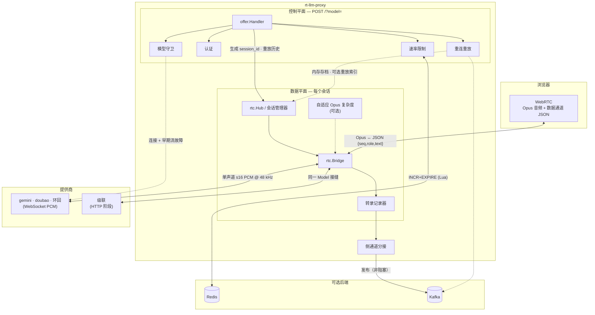
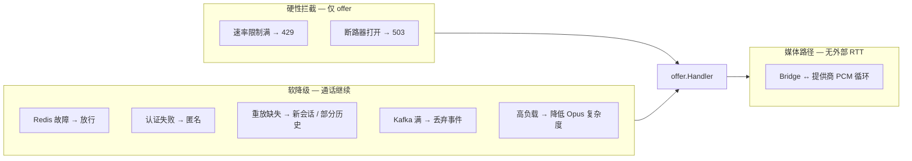
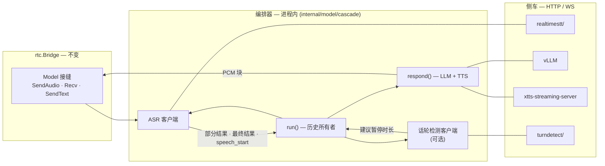
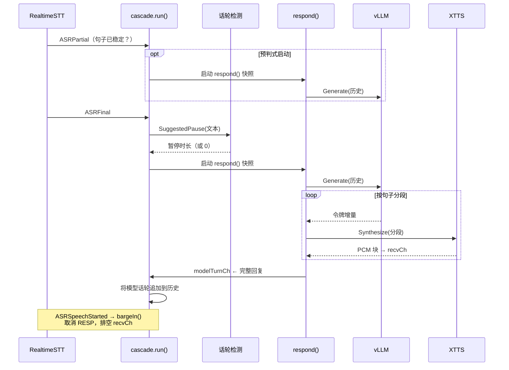

# 架构与工程笔记 — rt-llm-proxy

本文说明 rt-llm-proxy 的组成方式，以及**为什么**每个非显而易见的工程决策会这样设计。篇幅刻意保持精简——毕竟这是个小型项目。

| § | 主题 |
|---|---|
| **1** | 代理核心 — WebRTC 桥接、控制平面、容错 |
| **2** | **级联管道** — 编排器（进程内）+ 侧车（ASR/LLM/TTS/话轮检测） |
| **3** | 模块与接缝 |
| **4** | 工程优化（节拍、Opus、重放、…） |
| **5** | 测试 |

## 1. 架构

**核心不变量（硬约束）：** 控制/个性化平面绝不能阻塞实时媒体平面（§4.3）。下文中的容错策略都遵循这条原则——优先降级功能，而非中断通话；除非失败触发了明确的硬性拦截（容量触顶时的速率限制、断路器打开）。

### 1.1 系统概览



实线箭头表示热路径；虚线表示尽力而为或可选路径。Redis 和 Kafka **从不**参与 20ms 音频循环。

### 1.2 媒体数据路径

```
浏览器 ──WebRTC(Opus 音频 + 数据通道)──▶ rtc.Bridge ──▶ 提供商适配器
      ◀──────────── Opus 音频 ────────────              ◀──── PCM ──────
```

STS 提供商（gemini、doubao）通过 WebSocket 传输各自原生的 PCM 格式；`?model=cascade` 走**同一套** `Model` 接缝，但在 `internal/model/cascade` 内部串联 HTTP 阶段。

- **入站（麦克风 → 模型）：** `track.ReadRTP` → Opus 解码 → 单声道 s16 PCM @48kHz → `Model.SendAudio`。提供商适配器再重采样到各自的传输采样率。
- **出站（模型 → 扬声器）：** `Model.Recv` → 累积到缓冲区 → 按 20ms / 960 样本帧 Opus 编码 → `WriteSample`，**以实时速率推送**（会话级 `time.Ticker`，§4.1）。可选的 `-adaptive` 会在高负载下降低编码器复杂度（§4.11）。
- **数据通道：** 浏览器输入文本 → `Recorder.Record("user")` + `Model.SendText`；提供商 STT（`RecvTranscript`）→ `Recorder.Record` → 以 JSON `{seq,role,text}` 推回浏览器，以便重连时从 `last_seq` 恢复。

### 1.3 控制与重连路径


重连采用**尽力而为**策略：重放头格式错误 → `400`；头不完整 → 开新会话；重放索引超预算 → `index_timeout` / `index_error`，但通话继续。

### 1.4 容错与降级

| 层 | 组件 | 触发条件 | 策略 | 阻塞媒体？ |
|---|---|---|---|---|
| 控制 | `ratelimit` | Redis 错误 | **故障时放行**（允许 + 记日志） | 否 |
| 控制 | `ratelimit` | 窗口已满 | `429` | 是（仅 offer） |
| 控制 | `auth` | 令牌缺失/无效 | **匿名** `user_id=""` | 否 |
| 控制 | `modelcb` | 断路器打开 / 半开受限 | `503` + `Retry-After` | 是（仅 offer） |
| 控制 | `modelcb` | 连续 N 次连接失败 / 认证错误 | 按提供商打开断路器 | 是（仅 offer） |
| 控制 | `modelcb` | 首帧音频前流错误（10s 内） | `StreamFaultAt` → `RecordStreamFault` | 否 |
| 控制 | `ResolveReplay` | 超时 / 缺失 / 已禁用 | `X-Replay-Status` 降级 | 否 |
| 侧 | `sidechannel` / Kafka | 缓冲区满 / 已关闭 | **丢弃** + `dropped_total` | 否 |
| 数据 | `rtc.Bridge` | 提供商沉默 | Ticker 合并多余 tick（避免突发） | 否 |
| 数据 | Opus | 丢包 | 带内 FEC + DTX（上行 fmtp，下行编码器） | 否 |
| 数据 | `adaptive` | 会话数过高或帧延迟 | 降低 Opus 复杂度 | 否（质量换性能） |
| 数据 | 生命周期 | 断开 / SIGTERM | `sync.Once` 清理 · `CloseAll` | N/A |



故障转移级别（L1–L4）及生产环境扩缩容说明见 [README § 缩放与故障转移](../README.md)。

---

## 2. 级联管道

`?model=cascade` 选择一套**自托管 ASR → LLM → TTS** 堆栈，作为第四个提供商适配器接入。它实现 `model.Model` 和 `model.Transcriber`——Bridge、转录记录器、侧通道和重连机制**完全不变**，只是 Model 接缝背后的实现换了。

本章是深度说明；运维参数和 Docker Compose 见 [README § Cascade](../README.md#cascade)。

### 2.1 编排器与侧车

部署上分为**一个进程内编排器**和**四个外部侧车**。除话轮编排外，各阶段都在独立进程中运行；代理进程只托管编排器和轻量 HTTP/WebSocket 客户端。

| 层 | 运行位置 | 职责 |
|---|---|---|
| **编排器** | 代理进程内 `internal/model/cascade` | `run()` 话轮循环、`respond()` LLM→TTS 管道、插话打断、历史管理、业务接缝（`OnLLMToken`、`SetAudioSource`）。实现 `model.Model`——Bridge 把它当作 gemini/doubao 一样对待。 |
| **阶段客户端** | `internal/model/cascade/{asr,llm,tts,turndetect}/`，与编排器同进程 | 与各侧车通信协议的薄适配层。不是独立服务，通过 `cascade.Config` 注入。 |
| **侧车** | Docker 内网中的独立容器 | ASR（`realtimestt/`）、LLM（vLLM）、TTS（xtts-streaming-server）、话轮检测（`turndetect/`，可选）。仅代理端口对外暴露。 |

`rtc.Bridge` 和控制平面（速率限制、重放、Kafka 侧通道）属于**共享代理基础设施**——不属于级联编排器或其侧车。

### 2.2 端到端数据流



侧车间跳转都在单 GPU 主机的局域网内完成（约 1–5ms）。重采样和线格式转换留在**各阶段客户端内部**——Bridge 始终只看到单声道 s16 PCM @ 48 kHz（与 gemini/doubao 相同的约定）。

### 2.3 阶段与依赖注入

`cascade.Config` 接受可注入的阶段接口——与 `ratelimit.New(addr, …)` 同一模式，生产默认值在 `offer.ProdModelFactory` 中装配：

| 接口 | 阶段客户端（编排器侧） | 侧车 |
|---|---|---|
| `ASR` | `asr.NewWhisper(url)` | `realtimestt/` — Silero VAD + faster-whisper；部分结果、最终结果、`speech_start` |
| `LLM` | `llm.New(url, model)` | vLLM — OpenAI 兼容 API（默认 Qwen3.5-9B） |
| `TTS` | `tts.NewXTTSStream(url, …)` | xtts-streaming-server — 通过 `/tts_stream` 增量输出 PCM |
| `TurnDetector` | `turndetect.NewHTTP(url)` 或 `NopTurnDetector{}` | `turndetect/` — 句子结束分类器（可选） |

测试时用 `fakestage/` 存根替换（无需侧车）。Docker 栈见 `docker-compose.cascade.yml`——编排器在代理容器内，四个侧车在内网。

### 2.4 话轮编排

单个 `run()` goroutine 独占 `history` 和所有话轮状态——对话数据无需加锁。它消费 ASR 事件、输入的 `SendText`、话轮检测计时器，以及 `modelTurnCh` 传来的模型回复。



| 事件 | 处理 |
|---|---|
| `ASRPartial` | 通过 `RecvTranscript` 实时字幕；取消待处理话轮计时器；部分结果稳定时（约 200ms、以句末标点结尾）可**预判式**启动 LLM |
| `ASRSpeechStarted` | **插话打断**：取消进行中的 `respond()`，排空 `recvCh` |
| `ASRFinal` | 去重（Jaccard ≥ 0.9）；确认或丢弃预判；在话轮检测暂停后（或立即）调度 LLM |
| `SendText` | 与 ASR 最终结果走同一路径（数据通道输入） |

`respond()` 接收历史的**快照**，从不修改它。完成的回复经 `modelTurnCh` 回传，由 `run()` 作为唯一的历史写入者。

### 2.5 低延迟设计

四个机制叠加，缩短首帧音频时间（TTFA）：

1. **预判式 LLM 启动** — 看起来像完整句子的稳定 ASR 部分结果，会提前提交临时用户话轮并在 `ASRFinal` 之前启动 LLM。若与最终结果匹配，则修补文本并保留进行中的生成；不匹配则丢弃预判，从头开始。

2. **按句分段的流式 TTS** — `respond()` 在句界（`. ? !`、换行 / 中日韩标点）切分 LLM 令牌。分段器把完整句子推给并发 TTS worker，LLM 继续生成下一句。LLM 不会被合成阻塞。

3. **XTTS 流式输出** — 每个句子边合成边增量推送 PCM，句子尚未完全渲染即可开始播放。实现后还可选 `QuickSynthesizer` 路径处理首段。

4. **话轮检测（可选）** — `-cascade-turndetect` 在 ASR 最终结果后插入有界暂停，再提交话轮。未配置时默认 `NopTurnDetector`，立即触发。

### 2.6 插话打断（Barge-in）

由 RealtimeSTT 的 `ASRSpeechStarted` 触发（用户在机器人说话时开口）。取消顺序对齐 RealtimeVoiceChat 的 `process_abort_generation()`：

1. 取消 `genCtx` → 停止 LLM HTTP 流和 TTS 合成。
2. 等待 `genDone` → 确认 `respond()` goroutine 已退出。
3. 排空 `recvCh` → 丢弃排队音频，再开始下一话轮。

第 2 步是**关键约束**：缺少它时，旧的 `respond()` 可能在新话轮开始后仍往 `recvCh` 写数据。分段器和 `respond()` 内的 TTS worker 都在 `genCtx` 下运行，插话打断会一并取消它们。

重复话语（Jaccard 令牌相似度 ≥ 0.9）会被忽略——机器人不会对实质相同的输入重复开答。

### 2.7 业务接缝

级联暴露两个钩子，让核心代理保持业务无关，同时支持下游场景（例如个性化实时 DJ）。代码示例见 [README § Cascade](../README.md#cascade)。

**LLM 拦截 — `Config.OnLLMToken`**

每个令牌在进 TTS 前调用。返回 `("", false)` 原样通过，`(替代文本, true)` 替换，`("", true)` 静默丢弃。历史始终记录原始令牌。

**输出混音 — `Cascade.SetAudioSource`**

向出站音频注入任意 `AudioSource`（单声道 s16、48 kHz）。`Recv()` 从中读取直至 `io.EOF`，再无缝回退到 TTS。替换或清除源时会关闭前一个。

### 2.8 容错与重连

| 故障 | 策略 | 阻塞会话？ |
|---|---|---|
| LLM/TTS 瞬时 HTTP 错误 | 重试一次，仍失败则跳过该分段 | 否 |
| LLM/TTS 话轮中途硬错误 | 跳过该分段，话轮可能不完整 | 否 |
| GPU 主机崩溃 | 所有级联会话结束 | 是（单点故障） |
| 重连带重放头 | 转录行按 `seq` 恢复 | 否 |
| 重连后 LLM 上下文 | **不恢复** — 历史在 GPU 主机内存中 | 否（降级） |

级联重连与其他提供商共用 `X-Session-ID` / `X-Last-Seq`（按提供商隔离）。转录文本可重放；LLM 从 `-cascade-system` 加重放行开始，而非旧会话中已随进程消亡的内存 `history`。

多主机容灾需要三个阶段各自独立的重连与状态——超出当前单 GPU 部署范围。

---

## 3. 模块与接缝

| 模块 | 包 | 职责 |
|---|---|---|
| **Bridge** | `internal/rtc` | 终止一个浏览器 WebRTC 对等连接；双向泵送音频与数据通道文本。**仅**与 Model 接缝交互。拥有转录**记录器**（唯一记录点）。 |
| **会话存档** | `internal/rtc` (`sessionArchiveStore`) | 断开会话的内存重连存档，带 TTL 与所有权校验；供 `Resume`/`SessionState` 使用。 |
| **转录** | `internal/transcript` | 会话级 `Line{seq,role,text}` 与 `Recorder`——数据通道、重连历史、侧通道共享的 seq 权威来源。 |
| **会话 offer 摄入** | `internal/offer` (`Intake`) | 控制平面链：速率限制 → 提供商守卫 → 重连重放 → `Hub.Serve`。 |
| **Offer HTTP 适配器** | `internal/offer` (`Handler`) | 将 POST / 映射到 `Intake.ServeOffer`。 |
| **提供商守卫** | `internal/modelcb` | 按提供商的断路器：offer 上 `AllowDial` / `RecordDial`；Bridge 上通过 `StreamFaultAt` 报告早期流故障。 |
| **认证** | `internal/auth` | Bearer → offer 路径上的 `user_id`；失败时匿名放行。 |
| **自适应** | `internal/adaptive` | 可选的 Opus 编码复杂度控制器（`-adaptive`），高负载时降档。 |
| **Model 接缝** | `internal/model` | 与提供商无关的 `Model` 接口（`SendAudio`/`SendText`/`Recv`/`Close`）。可选 `Transcriber`（`RecvTranscript`）用于 STT。 |
| **提供商适配器** | `internal/model/gemini`, `internal/model/doubao` | 每个流式 STS API 一个具体 `Model` 实现，各自拥有 WebSocket 协议与原生音频格式。 |
| **级联** | `internal/model/cascade` | 进程内**编排器**——话轮循环、插话打断、业务接缝。见 [#cascade](#cascade)。 |
| **级联阶段** | `internal/model/cascade/asr`, `llm`, `tts`, `turndetect` | 进程内阶段客户端；侧车见 [§2.1](#orchestrator-vs-sidecars)。 |
| **侧通道** | `internal/sidechannel` | `Tap` 实现 `transcript.Listener`；用 Bridge 分配的 seq 将 `TranscriptEvent` 发布到 Kafka/stdout。 |
| **重放索引** | `cmd/replay`, `internal/replayindex` | Kafka 消费者 + HTTP 存储；跨节点重连提供 `GET /v1/replay`。 |
| **PCM 工具** | `internal/model/pcm` | `ToBytes` / `FromBytes`——s16le 上行序列化。两个适配器共用只是因为合约侧都是 s16；**不是**统一解码层。 |
| **音频** | `internal/audio` | Opus 编解码（cgo 调用 libopus）+ 线性重采样。 |
| **速率限制** | `internal/ratelimit` | SDP offer 端点的 Redis 固定窗口限流。**仅控制平面。** |
| **组合根** | `cmd/proxy` (`runProxy`) | 从配置装配运行时依赖，并管理进程关闭顺序。 |

### 音频约定（硬约束）

**穿过 Model 接缝的每个音频块都是单声道有符号 16 位 PCM，采样率 48kHz**（WebRTC Opus 的原生速率）。提供商在内部转换格式，Bridge 无需知道各家的线格式。正是这一 canonical 格式让 Bridge 完全与提供商解耦。

### 提供商不对称是刻意设计，不是重复代码

| 提供商 | 下行 → 合约格式 | 采样率来源 |
|---|---|---|
| Gemini | s16le | 从 MIME 类型按块读取（`inlineAudioToModelPCM`） |
| 豆包 | f32le | 固定常量 `24000`（`ttsToModelPCM`、`f32leToPCM`） |

Gemini 从线格式读取采样率是更稳妥的做法；豆包协议**无法**携带采样率，只能用不可校验的常量（dump 原始流分析一次即可确认）。**不要为了「看起来对称」把 Gemini 的按块采样率压成静态常量**——那会丢掉更安全的行为。

---

## 4. 工程优化点

每条记录说明：我们做了什么，以及它避免了哪种失败模式。

### 4.1 出站实时节拍，无时钟漂移

出站帧用**会话级单个 `time.Ticker`** 推送，而非每帧 `time.After(frameDur)`。

- **为什么要节拍控制：** 一次性把整段响应灌给浏览器会撑爆抖动缓冲区。我们按实时速率供音频（对齐参考实现 `proxy.py`）。
- **为什么用 Ticker 而非 `time.After`：** `time.After` 的 20ms 在编码 + `WriteSample` **之后**才开始计时，每帧实际周期是 `20ms + 编码耗时`，慢于实时，缓冲区积压，端到端延迟随响应长度单调增长。Ticker 按固定墙钟触发，编码时间被吸收在 20ms 窗口内而非叠加其上 → 零漂移。
- **沉默处理：** `Recv` 因提供商沉默而阻塞时 Ticker 仍触发，但 size-1 通道会合并多余 tick——恢复语音时**不会**突发积压帧。

### 4.2 原子速率限制 + 故障时放行

- **Lua 脚本实现原子 `INCR+EXPIRE`。** 分开执行 `INCR` 再 `EXPIRE` 有崩溃窗口：进程死在两者之间时键**没有 TTL**，计数器永不重置，该 IP **永久被封**。Lua 把两步合成原子操作。
- **Redis 错误时故障放行。** 速率限制是控制平面上的软守卫；Redis 抖动不应拖垮实时服务。出错时 `Allow` 返回 `true`，仅记录日志。

### 4.3 Redis 严格限于控制平面

Redis **只**接触 SDP offer 端点（会话创建速率）。媒体路径（Opus ↔ PCM ↔ 提供商）从不向 Redis 发网络请求——让 20ms 音频帧绕道 Redis 会增加延迟，也违背实时代理的设计初衷。这是不变量，不是偶然。

### 4.4 共享 pion API / MediaEngine

`Hub` **一次**构建 pion `API`（带 Opus 调优的 `MediaEngine` + 默认拦截器），每个对等连接复用，而非每会话重建编解码器/拦截器状态。

### 4.5 有损链路上的 Opus 调优

两个方向各调一次 Opus，适配有损链路上的实时语音。两侧都以少量保真度换取韧性和带宽。

**浏览器 → 代理（麦克风上行）。** Answer SDP 在注册的 Opus 编解码器上公布如下 fmtp：

`minptime=10;useinbandfec=1;usedtx=1;maxaveragebitrate=16000`

| fmtp 字段 | 作用 |
|---|---|
| `minptime=10` | 允许 10ms 帧，降低首包 / 短句延迟。 |
| `useinbandfec=1` | 带内 FEC：丢包后从后续包恢复部分音频。 |
| `usedtx=1` | DTX：沉默期抑制完整帧，省带宽、减抖动缓冲压力。 |
| `maxaveragebitrate=16000` | 平均码率上限约 16 kbps，窄带语音足够 LLM 对话。 |

代理用**单声道**解码器（`audio/opus.go`）；SDP 中的立体声是正常 WebRTC 协商，会自动下混为单声道。

**代理 → 浏览器（模型下行）。** `writeOutbound` 经 `audio.NewEncoder` 编码：`AppVoIP`、带内 FEC + DTX、`PacketLossPerc=10`（编码器侧真正启用 FEC 所必需——仅靠 fmtp 不够）。帧长 20ms / 960 样本 @ 48kHz，由 §4.1 的 Ticker 推送。

### 4.6 非 Trickle ICE，仅 Host 候选

`Serve` 等待 `GatheringCompletePromise`，返回带候选的**完整** answer SDP（非 trickle）。无 STUN/TURN/SFU（`iceServers=[]`）。代理**刻意不做** NAT 穿透基础设施——信令更简单、组件更少。代价：媒体无法穿越集群 NAT；水平扩展与故障转移按设计是部分的（L1–L4，见 README「缩放与故障转移」）。请在浏览器能直连的主机上跑容器。

### 4.7 整数倍采样率的线性重采样

使用线性插值。在整数倍率（48k↔16k、24k→48k）下输出长度精确、块边界对齐，伪影极小——对语音足够。若日后对质量有更高要求，可换多相滤波器。

### 4.8 生命周期与背压

- **幂等清理：** `session.cleanup` 在 `sync.Once` 下执行；连接状态变化、模型 EOF、Hub 关闭都经它安全收敛。
- **优雅关闭：** `Hub` 跟踪活跃会话；SIGINT/SIGTERM 先 `CloseAll`，再关闭 HTTP 服务器。
- **RTCP 排空：** 独立 goroutine 读取发送方 RTCP，避免发送缓冲区填满而阻塞出站轨道。
- **会话长于请求：** 模型连接 + `Serve` 使用后台 context，媒体会话不绑定 SDP HTTP 请求的生命周期。

### 4.9 重连重放策略（尽力而为、有界）

- **协议：** 重连使用 `X-Replay-Version: 1`、`X-Session-ID`、`X-Last-Seq`；服务器回复 `X-Replay-Status`。
- **解析：** `offer.ResolveReplay` 校验头，先查内存存档，再查可选重放索引（`-replay-url`）。
- **严格但不阻塞：** 格式错误的 `X-Last-Seq` / 不支持的重放版本 → `400`；缺失 id/seq 则回退为新会话。
- **按提供商隔离：** 仅当重连提供商与原始会话一致时才重放，避免跨模型污染转录。
- **数据源顺序：** 同节点内存存档优先，重放索引 HTTP 次之；硬预算（`-replay-timeout`，默认 `300ms`）与行数上限（`-replay-limit`，默认 `100`）。
- **Seq 不变量：** `transcript.Recorder` 只分配一次 seq；侧通道 `Tap` 与数据通道 JSON 复用同一 seq（无独立计数器）。
- **不变量保持：** 重放是控制平面尽力而为；超时/错误永不阻塞媒体启动；`-replay-url` 为空时跨节点重放禁用。

### 4.10 提供商守卫

- **范围：** 在 offer 路径拦截**新**拨号（`Models.New` 前的 `AllowDial`）。已建立的媒体会话连接后不受影响。
- **策略：** 断路器打开/半开受限时返回 `503`，附带 `Retry-After`、`X-Model-CB-State`、`X-Model-CB-Reason`。
- **状态机：** `closed → open → half_open → closed`；半开时每个提供商同时只允许一次探测请求。
- **错误敏感度：** 认证类拨号失败（`401/403`、unauthorized/forbidden）立即打开，较长保持（`-model-cb-auth-open-for`，默认 5m）。非认证拨号失败在 `-model-cb-open-after` 次连续失败后打开。
- **恢复：** 拨号成功（`RecordDial(nil)`）会重置该提供商的拨号与早期流故障计数。
- **早期流故障：** 提供商 WebSocket 已连接，但 `Recv` 在 `modelcb.EarlyFaultWindow`（10s）内、首帧音频前就出错时，`writeOutbound` 经 `StreamFaultAt` → `RecordStreamFault` 上报——捕获「连上了但一用就死」。早期流故障与拨号失败分开计数。
- **隔离：** 断路器按提供商隔离，支持按提供商覆盖。Loopback 和 nil 管理器跳过全部守卫逻辑。

### 4.11 自适应 Opus 复杂度

编码 CPU 占每会话成本大头（默认复杂度约 161µs/帧）。原子复杂度值每次编码重读；控制器在媒体路径外运行，最多选错质量档位，不会阻塞会话。

- **`sessions`（推荐）：** 按活跃会话数的 proactive 阶梯函数，带滞后——在节拍打滑前释放 CPU，无反馈环路。
- **`drift`（实验性）：** 对 ≥30ms 晚帧比例做反应式调节；贴近真实 SLO，但持续负载下可能振荡（与已回退的共享 timing wheel 同类风险）。

---

## 5. 测试

- `internal/model/gemini`、`internal/model/doubao` — 音频与转录解码。
- `internal/model/cascade` — 话轮编排、插话打断、预判式部分结果、LLM 拦截接缝、输出混音接缝（`fakestage/` 存根）。
- `internal/offer` — 会话 offer 摄入（速率限制、守卫、模型生命周期）与重连重放解析（表驱动）。
- `internal/modelcb` — 提供商守卫拨号与早期流故障策略。
- `internal/transcript`、`internal/rtc` — 记录器 seq 与监听器通知。
- `internal/ratelimit` — 触顶拒绝、窗口重置（TTL 已设置）、Redis 不可达时故障放行、禁用限流器直通（miniredis）。
- `internal/replayindex`、`internal/sidechannel` — 重放索引客户端与存储。
- `docs/bench/` — Opus 微基准与容量扫描（见 [`docs/bench/README.md`](bench/README.md)）。

---

## 相关文档

- [快速开始](QUICK_START.md) — 5 分钟上手
- [部署指南](DEPLOYMENT.md) — 完整部署手册
- [中文指南](中文指南.md) — 中文概览
