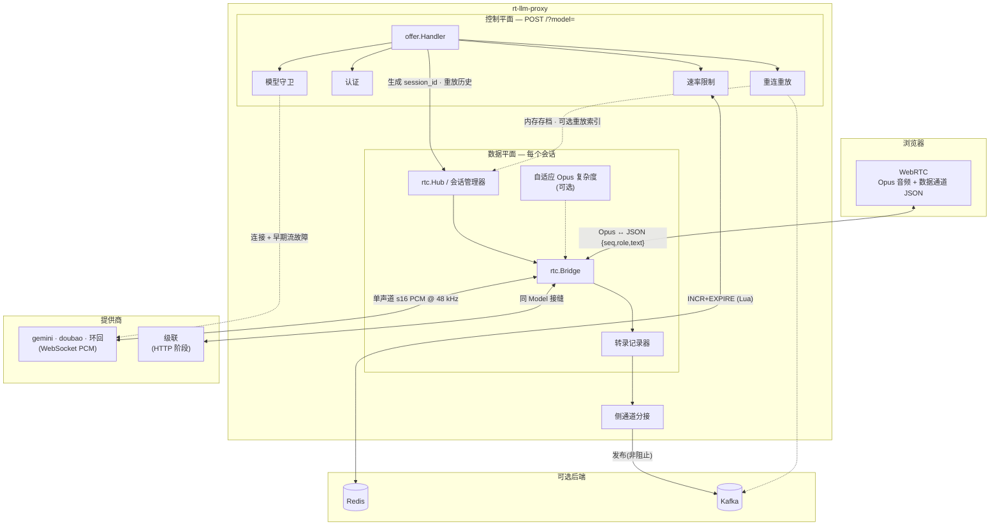
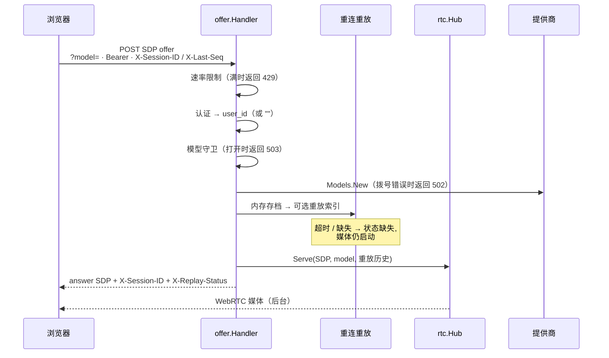
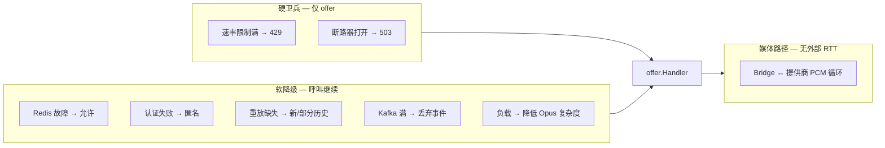
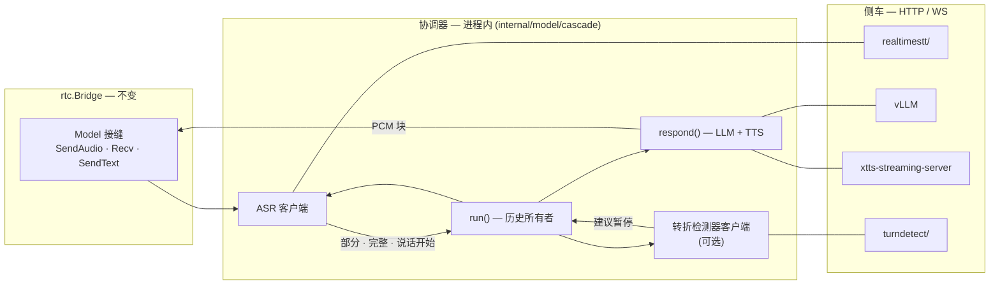
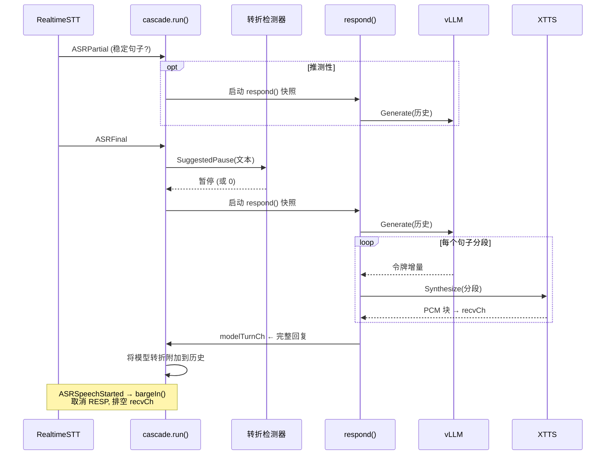

# 架构与工程笔记 — rt-llm-proxy

rt-llm-proxy 的组成方式，以及**为什么**每个非显而易见的工程决策是这样的。意图保持简洁 — 这是一个小项目。

| § | 主题 |
|---|---|
| **1** | 代理核心 — WebRTC 网桥、控制平面、容错 |
| **2** | **级联管道** — 协调器（进程内）+ 侧车（ASR/LLM/TTS/转折检测） |
| **3** | 模块与接缝 |
| **4** | 工程优化（步调、Opus、重放、…） |
| **5** | 测试 |

## 1. 架构

**不变量（承载）：** 控制/个性化平面绝不能阻止实时媒体平面（§4.3）。下面的容错遵循这条规则 — 降级功能而不是呼叫，除非失败是显式硬卫兵（容量时的速率限制、断路器打开）。

### 1.1 系统概览



实线箭头在热路径上；虚线箭头是最佳努力或可选。Redis 和 Kafka **从不**在 20ms 音频循环上。

### 1.2 媒体数据路径

```
浏览器 ──WebRTC(Opus 音频 + 数据通道)──▶ rtc.Bridge ──▶ 提供商适配器
      ◀──────────── Opus 音频 ────────────              ◀──── PCM ──────
```

STS 提供商（gemini、doubao）通过 WebSocket 与提供商原生 PCM 通信；`?model=cascade` 使用**相同的** `Model` 接缝，但在 `internal/model/cascade` 内链接 HTTP 阶段。

- **入站（麦克风 → 模型）：** `track.ReadRTP` → Opus 解码 → 单声道 s16 PCM @48kHz → `Model.SendAudio`。提供商适配器重采样到其自己的传输速率。
- **出站（模型 → 扬声器）：** `Model.Recv` → 累积到缓冲区 → Opus 编码每个 20ms / 960 样本帧 → `WriteSample`，**以实时速率步调**（会话 `time.Ticker`，§4.1）。可选的 `-adaptive` 在负载下降低编码器复杂度（§4.11）。
- **数据通道：** 浏览器输入文本 → `Recorder.Record("user")` + `Model.SendText`；提供商 STT（`RecvTranscript`）→ `Recorder.Record` → 浏览器为 JSON `{seq,role,text}` 以便重连可从 `last_seq` 恢复。

### 1.3 控制与重连路径



重连是**最佳努力**：格式错误的重放头 → `400`；不完整的头 → 新会话；重放索引超预算 → `index_timeout` / `index_error`，但呼叫继续。

### 1.4 容错与降级

| 层 | 组件 | 触发 | 策略 | 阻止媒体？ |
|---|---|---|---|---|
| 控制 | `ratelimit` | Redis 错误 | **失败开放**（允许 + 日志） | 否 |
| 控制 | `ratelimit` | 窗口满 | `429` | 是（仅 offer） |
| 控制 | `auth` | 缺少/无效令牌 | **匿名** `user_id=""` | 否 |
| 控制 | `modelcb` | 断路器打开/半开门控 | `503` + `Retry-After` | 是（仅 offer） |
| 控制 | `modelcb` | N 连接失败/认证错误 | 打开每个提供商 | 是（仅 offer） |
| 控制 | `modelcb` | 首音频前流错误（10s 内） | `StreamFaultAt` → `RecordStreamFault` | 否 |
| 控制 | `ResolveReplay` | 超时/缺失/禁用 | `X-Replay-Status` 降级 | 否 |
| 侧 | `sidechannel` / Kafka | 缓冲区满/关闭 | **丢弃** + `dropped_total` | 否 |
| 数据 | `rtc.Bridge` | 提供商沉默 | Ticker 合并滴答（无突发） | 否 |
| 数据 | Opus | 数据包丢失 | 带外 FEC + DTX（上行 fmtp，下行编码器） | 否 |
| 数据 | `adaptive` | 高会话计数或帧漂移 | 降低 Opus 复杂度 | 否（质量权衡） |
| 数据 | 生命周期 | 断开/SIGTERM | `sync.Once` 清理 · `CloseAll` | N/A |



**故障转移级别 (L1–L4) 和生产缩放注意事项在 [README § 缩放与故障转移](../README.md) 中。**

---

## 2. 级联管道

`?model=cascade` 选择一个**自托管 ASR → LLM → TTS** 堆栈，作为第四个提供商适配器。它实现 `model.Model` 和 `model.Transcriber` — Bridge、转录记录器、侧通道和重连机制**不变**。仅 Model 接缝后的对象不同。

本章是深度探讨；操作标志和 Docker Compose 在 [README § Cascade](../README.md#cascade)。

### 2.1 协调器 vs 侧车

部署分为**一个进程内协调器**和**四个外部侧车**。除了转折编排外，一切都在进程外运行；代理进程仅托管协调器和薄 HTTP/WebSocket 客户端。

| 层 | 运行位置 | 做什么 |
|---|---|---|
| **协调器** | 代理内部 `internal/model/cascade` | `run()` 转折循环、`respond()` LLM→TTS 管道、抢断、历史、业务接缝（`OnLLMToken`、`SetAudioSource`）。实现 `model.Model` — Bridge 如同对待 gemini/doubao。 |
| **阶段客户端** | `internal/model/cascade/{asr,llm,tts,turndetect}/` — 与协调器同一进程 | 薄适配器，与每个侧车的传输协议通信。不是单独的服务；通过 `cascade.Config` 连接。 |
| **侧车** | Docker 网络内的单独容器 | ASR（`realtimestt/`）、LLM（vLLM）、TTS（xtts-streaming-server）、转折检测（`turndetect/`，可选）。仅代理端口暴露于公共。 |

`rtc.Bridge` 和控制平面（速率限制、重放、Kafka 侧通道）是**共享代理基础设施** — 不是级联协调器或其侧车的一部分。

### 2.2 端到端数据流



所有侧车跳跃是 LAN 本地的单个 GPU 主机上（~1–5ms）。重采样和传输格式保持**在每个阶段客户端内** — Bridge 仅看到单声道 s16 PCM @ 48 kHz（与 gemini/doubao 相同的合约）。

### 2.3 阶段和注入

`cascade.Config` 接受可注入的阶段接口 — 与 `ratelimit.New(addr, …)` 相同的模式，在 `offer.ProdModelFactory` 中连接生产默认值：

| 接口 | 阶段客户端（协调器） | 侧车 |
|---|---|---|
| `ASR` | `asr.NewWhisper(url)` | `realtimestt/` — Silero VAD + faster-whisper；部分、完整、`speech_start` |
| `LLM` | `llm.New(url, model)` | vLLM — OpenAI 兼容 API（默认 Qwen3.5-9B） |
| `TTS` | `tts.NewXTTSStream(url, …)` | xtts-streaming-server — 通过 `/tts_stream` 增量 PCM |
| `TurnDetector` | `turndetect.NewHTTP(url)` 或 `NopTurnDetector{}` | `turndetect/` — 句子完成分类器（可选） |

测试在 `fakestage/` 存根中交换（无侧车）。Docker 堆栈：`docker-compose.cascade.yml` — 代理容器中的协调器，内部网络上的四个侧车。

### 2.4 转折编排

一个 `run()` goroutine 拥有 `history` 和所有转折状态 — 对话数据无锁。它读取 ASR 事件、输入的 `SendText`、转折检测计时器和来自 `modelTurnCh` 的完成模型回复。



| 事件 | 行动 |
|---|---|
| `ASRPartial` | 通过 `RecvTranscript` 直播字幕；取消待处理转折计时器；当部分稳定时（~200ms、以句子结尾标点）可选**推测性** LLM 启动 |
| `ASRSpeechStarted` | **抢断**：取消进行中的 `respond()`、排空 `recvCh` |
| `ASRFinal` | 去重（Jaccard ≥ 0.9）；确认或丢弃推测；在转折检测暂停后（或立即）安排 LLM |
| `SendText` | 与 ASR 最终相同路径（输入的数据通道输入） |

`respond()` 接收历史**快照**并从不改变它。完成的回复通过 `modelTurnCh` 传回，以便 `run()` 保持为唯一历史编写器。

### 2.5 低延迟设计

四个机制堆叠以减少首音频时间 (TTFA)：

1. **推测性 LLM 启动** — 看起来像完整句子的稳定 ASR 部分提交临时用户转折并在 `ASRFinal` 前启动 LLM。匹配最终修补文本并保持进行中的生成；不匹配丢弃推测并从头开始。

2. **句子分段流式 TTS** — `respond()` 在句子边界（`. ? !` 换行 / CJK 标点）分割 LLM 令牌。分割器将完成的句子推送到并发 TTS 工作线程，LLM 继续生成下一个。LLM 从不被阻止等待合成。

3. **XTTS 流式** — 每个句子在合成时增量流式 PCM，所以播放在句子完全渲染前开始。当实现时的可选 `QuickSynthesizer` 路径。

4. **转折检测（可选）** — `-cascade-turndetect` 在 ASR 最终后添加有界暂停，再然后提交转折。`NopTurnDetector`（未设置时的默认值）立即触发。

### 2.6 抢断

由 RealtimeSTT 的 `ASRSpeechStarted` 触发（用户在机器人说话时开始说话）。取消序列镜像 RealtimeVoiceChat `process_abort_generation()`：

1. 取消 `genCtx` → 停止 LLM HTTP 流和 TTS 合成。
2. 等待 `genDone` → `respond()` goroutine 已退出。
3. 排空 `recvCh` → 在下一个转折开始前丢弃排队的音频。

第 2 步是承载：没有它，旧 `respond()` 可能在新转折开始后写入 `recvCh`。分割器和 `respond()` 中的 TTS 工作线程都在 `genCtx` 下运行，所以抢断一起取消它们。

重复话语（Jaccard 令牌相似度 ≥ 0.9）被忽略 — 机器人不会重新启动它已经为本质相同的输入给出的回复。

### 2.7 业务接缝

级联暴露两个钩子，保持核心代理业务无关，同时启用下游用例（如个性化实时 DJ）。代码示例在 [README § Cascade](../README.md#cascade)。

**LLM 拦截 — `Config.OnLLMToken`**

在 TTS 前每个令牌调用。返回 `("", false)` 通过，`(替代, true)` 替换，`("", true)` 静默丢弃。历史始终接收原始令牌。

**输出混合 — `Cascade.SetAudioSource`**

注入任何 `AudioSource`（单声道 s16、48 kHz）到出站音频。`Recv()` 从它读取直到 `io.EOF`，然后无缝回退到 TTS。替换或清除源会关闭前一个。

### 2.8 容错与重连

| 失败 | 策略 | 阻止会话？ |
|---|---|---|
| LLM/TTS 瞬态 HTTP 错误 | 重试一次，然后跳过分段 | 否 |
| LLM/TTS 硬错误中转 | 跳过分段，转折可能不完整 | 否 |
| GPU 主机崩溃 | 所有级联会话结束 | 是（SPOF） |
| 重连带重放头 | 转录行通过 `seq` 恢复 | 否 |
| 重连 LLM 上下文 | **未恢复** — 历史在 GPU 主机上 | 否（降级） |

级联重连使用与其他提供商相同的 `X-Session-ID` / `X-Last-Seq` 路径（提供商范围）。转录文本重放；LLM 从 `-cascade-system` 加上任何重放行（Bridge 注入）开始，而不是与旧会话一起死亡的内存中 `history` 切片。

对于多主机复原力，三个阶段需要独立的重连和状态 — 超出当前单 GPU 部署的范围。

---

## 3. 模块与接缝

| 模块 | 包 | 角色 |
|---|---|---|
| **Bridge** | `internal/rtc` | 终止一个浏览器 WebRTC 对等连接；双向泵送音频 + 数据通道文本。**仅**与 Model 接缝通话。拥有转录**记录器**（单一记录点）。 |
| **会话存档** | `internal/rtc` (`sessionArchiveStore`) | 断开连接会话的内存重连存档，带 TTL + 所有权检查；由 `Resume`/`SessionState` 使用。 |
| **转录** | `internal/transcript` | 会话范围 `Line{seq,role,text}` 和 `Recorder` — 数据通道、重连历史和侧通道共享的单个 seq 权威。 |
| **会话 offer 摄入** | `internal/offer` (`Intake`) | 控制平面链：速率限制、提供商守卫、重连重放、然后 `Hub.Serve`。 |
| **Offer HTTP 适配器** | `internal/offer` (`Handler`) | 将 POST / 映射到 `Intake.ServeOffer`。 |
| **提供商守卫** | `internal/modelcb` | 每个提供商断路器：offer 上的 `AllowDial` / `RecordDial`；Bridge 上通过 `StreamFaultAt` 的早期流错误。 |
| **认证** | `internal/auth` | Bearer → offer 路径上的 `user_id`；失败开放匿名。 |
| **自适应** | `internal/adaptive` | 可选 Opus 编码复杂度控制器在负载下（`-adaptive`）。 |
| **Model 接缝** | `internal/model` | 提供商无关的 `Model` 接口（`SendAudio`/`SendText`/`Recv`/`Close`）。可选 `Transcriber`（`RecvTranscript`）用于 STT。 |
| **提供商/适配器** | `internal/model/gemini`, `internal/model/doubao` | 每个流式 STS API 一个具体 `Model`。每个拥有其 WebSocket 协议和原生音频格式。 |
| **级联** | `internal/model/cascade` | 进程内**协调器** — 转折循环、抢断、业务接缝。见 [#cascade](#cascade)。 |
| **级联阶段** | `internal/model/cascade/asr`, `llm`, `tts`, `turndetect` | 进程内阶段客户端；侧车在 [§2.1](#orchestrator-vs-sidecars)。 |
| **侧通道** | `internal/sidechannel` | `Tap` 实现 `transcript.Listener`；使用 Bridge 分配的 seq 发布 `TranscriptEvent` 到 Kafka/stdout。 |
| **重放索引** | `cmd/replay`, `internal/replayindex` | Kafka 消费者 + HTTP 存储；为跨节点重连提供 `GET /v1/replay`。 |
| **PCM 帮助器** | `internal/model/pcm` | `ToBytes` / `FromBytes` — s16le 上行序列化。共享仅因为两个适配器都序列化合约侧 s16；**不是**统一解码层。 |
| **音频** | `internal/audio` | Opus 编解码（通过 cgo 的 libopus）+ 线性重采样。 |
| **速率限制** | `internal/ratelimit` | SDP offer 端点的 Redis 固定窗口限制器。**仅控制平面。** |
| **组合根** | `cmd/proxy` (`runProxy`) | 从配置连接运行时适配器并拥有进程关闭顺序。 |

### 音频合约（承载）

**跨越 Model 接缝的每个音频块都是单声道有符号 16 位 PCM，采样率 48kHz**（WebRTC 的原生 Opus 速率）。提供商在内部转换为/来自其自己的格式，所以 Bridge 永不知道提供商的传输格式。这个单一规范格式是保持 Bridge 完全提供商无关的原因。

### 提供商不对称是有意的，不是重复

| 提供商 | 下游 → 合约 | 速率源 |
|---|---|---|
| Gemini | s16le | 从 MIME 类型（`inlineAudioToModelPCM`）每块读取 |
| 豆包 | f32le | 固定 `24000` 常数（`ttsToModelPCM`、`f32leToPCM`） |

Gemini 从传输线读取速率是更安全的模式；豆包的协议*不能*携带它，所以其速率是不可验证的常数（通过转储 + 分析原始流一次确认）。**不要为了看起来对称就将 Gemini 的每块速率压平成静态常数** — 那会删除更安全的行为。

---

## 4. 工程优化点

每个条目：我们做什么，以及它避免的失败模式。

### 4.1 实时出站步调，无时钟漂移

我们用**单个会话级 `time.Ticker`** 步调出站帧，而不是每帧 `time.After(frameDur)`。

- **为什么要步调：** 一次将整个响应转储到浏览器会溢出其抖动缓冲区。我们以实时速率供应音频（镜像参考 `proxy.py`）。
- **为什么是 Ticker 而不是 `time.After`：** `time.After` 在编码 + `WriteSample` 工作**后**启动其 20ms，所以每帧的实际周期是 `20ms + 编码`。那比实时慢，所以缓冲区备份，端到端延迟随响应长度单调增长。Ticker 在固定壁钟上触发；编码时间被吸收到 20ms 中而不是添加在顶部 → 零漂移。
- **沉默处理：** 当 `Recv` 阻止提供商沉默时 Ticker 继续触发，但其大小 1 通道合并额外滴答 — 所以恢复语音**不**突发一堆帧。

### 4.2 原子速率限制 + 失败开放

- **通过 Lua 脚本的原子 `INCR+EXPIRE`。** 单独 `INCR` 然后 `EXPIRE` 有崩溃窗口：在两者之间死亡使键没有** TTL，所以计数器从不重置，IP **永远被锁定。Lua 脚本使两者成为一个原子步骤。
- **Redis 错误时失败开放。** 速率限制是控制平面上的软卫兵；Redis 故障不应取下实时服务。出错时 `Allow` 返回 `true` 并仅表面日志错误。

### 4.3 Redis 严格保持在控制平面

Redis **仅**触及 SDP offer 端点（会话创建率）。媒体路径（Opus ↔ PCM ↔ 提供商）从不进行网络往返到 Redis — 通过 Redis 路由 20ms 音频帧会添加延迟并违反实时代理的点。这是不变量，不是事故。

### 4.4 共享 pion API / MediaEngine

`Hub` 构建 pion `API`（带 Opus 调优 `MediaEngine` + 默认拦截器）**一次**并为每个对等连接重用，而不是重建每个会话的编解码器/拦截器状态。

### 4.5 Opus 调优用于有损/安静链接

Opus 调优两次 — 每个方向一次 — 用于实时语音在有损链接上。两侧为复原力和带宽交易一点保真度。

**浏览器 → 代理（麦克风上行）。** 答案 SDP 在注册的 Opus 编解码器上公布这个 fmtp：

`minptime=10;useinbandfec=1;usedtx=1;maxaveragebitrate=16000`

| fmtp 字段 | 效果 |
|---|---|
| `minptime=10` | 允许 10ms 帧 — 降低首数据包 / 短话语延迟。 |
| `useinbandfec=1` | 带外 FEC：从丢失后的后续数据包恢复部分音频。 |
| `usedtx=1` | DTX：在沉默期间抑制完整帧 — 节省带宽和抖动缓冲区压力。 |
| `maxaveragebitrate=16000` | 上限平均比特率 ~16 kbps — 窄带语音足以用于 LLM 对话。 |

代理用**单声道**解码器（`audio/opus.go`）解码；SDP 中的立体声是正常 WebRTC 协商，自动混为单声道。

**代理 → 浏览器（模型下行）。** `writeOutbound` 通过 `audio.NewEncoder` 编码：`AppVoIP`、带外 FEC + DTX 和 `PacketLossPerc=10`（实际上在编码器侧激活 FEC 的 — 仅 fmtp 不够）。帧是 20ms / 960 样本 @ 48kHz，由 §4.1 Ticker 步调。

### 4.6 非涓流 ICE，仅主机候选

`Serve` 等待 `GatheringCompletePromise` 并返回**完整** answer SDP 与候选（非涓流）。无 STUN/TURN/SFU（`iceServers=[]`）。代理是有意**不是** NAT 穿透基础设施 — 更简单的信令、更少的活动部件。权衡：媒体不会穿过集群 NAT；水平扩展和故障转移按设计部分（L1–L4 — 见 README 的"缩放与故障转移"）。在浏览器可直接到达的主机上运行容器。

### 4.7 整数比率的线性重采样

我们使用线性插值。在我们的整数比率（48k↔16k、24k→48k）处输出长度正确，每块边界对齐，所以文物最小 — 对语音足够好。如果质量重要，交换多相滤波器。

### 4.8 生命周期与背压

- **幂等撤销：** `session.cleanup` 在 `sync.Once` 下运行；连接状态变化、模型 EOF 和 hub 关闭都通过它安全漏斗。
- **优雅关闭：** `Hub` 追踪直播会话；SIGINT/SIGTERM 调用 `CloseAll`，再然后 HTTP 服务器关闭。
- **RTCP 排空：** goroutine 读取发送方的 RTCP，所以发送缓冲区不填充并阻止出站轨道。
- **会话超过请求：** 模型连接 + `Serve` 使用背景上下文，所以媒体会话未绑定到 SDP HTTP 请求的生命周期。

### 4.9 重连重放策略（最佳努力、有界）

- **协议：** 重连使用 `X-Replay-Version: 1`、`X-Session-ID`、`X-Last-Seq`；服务器用 `X-Replay-Status` 回复。
- **解析：** `offer.ResolveReplay` 验证头并首先尝试内存存档，然后可选重放索引（`-replay-url`）。
- **严格但非阻止：** 格式错误的 `X-Last-Seq` / 不支持的重放版本返回 `400`；缺失 id/seq 简单回退到新会话。
- **提供商范围：** 仅当重连提供商与原始会话/提供商匹配时重放，以避免跨模型转录污染。
- **源顺序：** 内存存档首先（同节点），重放索引 HTTP 第二；硬预算（`-replay-timeout`、默认 `300ms`）和有界行（`-replay-limit`、默认 `100`）。
- **Seq 不变量：** `transcript.Recorder` 分配 seq 一次；侧通道 `Tap` 和数据通道 JSON 都重用该 seq（无独立计数器）。
- **不变量保留：** 重放是控制平面最佳努力；超时/错误永不阻止媒体启动，当 `-replay-url` 为空时跨节点重放被禁用。

### 4.10 提供商守卫

- **范围：** 阻止 offer 路径上的**新**拨号（`Models.New` 前的 `AllowDial`）。建立的媒体会话一旦连接不受影响。
- **策略：** 当断路器打开/半开门控时用 `503` 失败，加上 `Retry-After`、`X-Model-CB-State`、`X-Model-CB-Reason`。
- **状态机：** `closed -> open -> half_open -> closed`；半开每个提供商一次允许单个探针请求。
- **错误敏感性：** 认证类拨号失败（`401/403`、未授权/禁止）立即打开，带更长的持有（`-model-cb-auth-open-for`、默认 5m）。非认证拨号失败在 `-model-cb-open-after` 连续拨号缺失后打开。
- **恢复：** 成功拨号（`RecordDial(nil)`）为该提供商重置拨号和早期流故障条纹。
- **早期流故障：** 如果提供商 WebSocket 连接但 `Recv` 在 `modelcb.EarlyFaultWindow`（10s）内任何音频前出错，`writeOutbound` 通过 `StreamFaultAt` → `RecordStreamFault` 报告 — 捕获"连接但到达时已死"。早期流故障单独从拨号故障计数。
- **隔离：** 断路器按提供商，带可选按提供商覆盖。Loopback 和 nil 管理器跳过所有守卫逻辑。

### 4.11 自适应 Opus 复杂度

编码 CPU 支配每会话成本（~161µs/帧在默认复杂度）。原子复杂度值在每个编码处重读；控制器离媒体路径运行，仅可误选质量，永不阻止会话。

- **`sessions`（推荐）：** 活会话计数的前摄步函数，带滞后 — 在步调滑动前释放 CPU，无反馈循环。
- **`drift`（实验性）：** 在 ≥30ms 晚帧分数上反应性；追踪真实 SLO 但在持续负载下可能振荡（与还原共享计时轮的相同风险）。

---

## 5. 测试

- `internal/model/gemini`、`internal/model/doubao` — 音频 + 转录解码。
- `internal/model/cascade` — 转折编排、抢断、推测部分、LLM 拦截接缝、输出混合接缝（使用 `fakestage/` 存根）。
- `internal/offer` — 会话 offer 摄入（速率限制、守卫、模型生命周期）和重连重放解析（表驱动）。
- `internal/modelcb` — 提供商守卫拨号 + 早期流故障策略。
- `internal/transcript`、`internal/rtc` — 记录器 seq + 监听器通知。
- `internal/ratelimit` — 最大拒绝、窗口重置（TTL 被设置）、Redis 不可达时失败开放、禁用限制器通过（使用 miniredis）。
- `internal/replayindex`、`internal/sidechannel` — 重放索引客户端 + 存储。
- `docs/bench/` — Opus 微基准基线和容量扫描（见 [`docs/bench/README.md`](bench/README.md)）。

---

## 相关文档

- [快速开始](QUICK_START.md) — 5 分钟设置
- [部署指南](DEPLOYMENT.md) — 完整部署手册
- [中文指南](中文指南.md) — 中文概览

