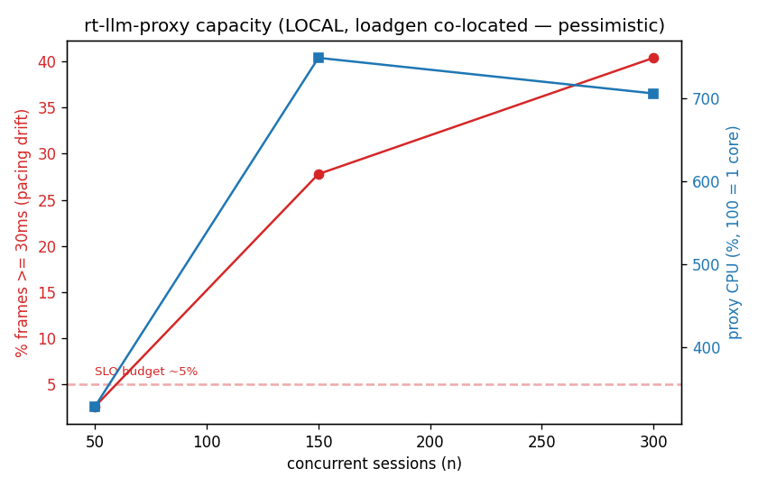
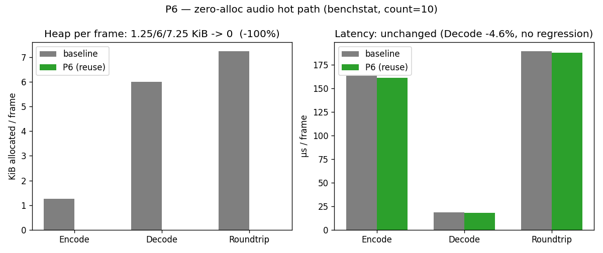
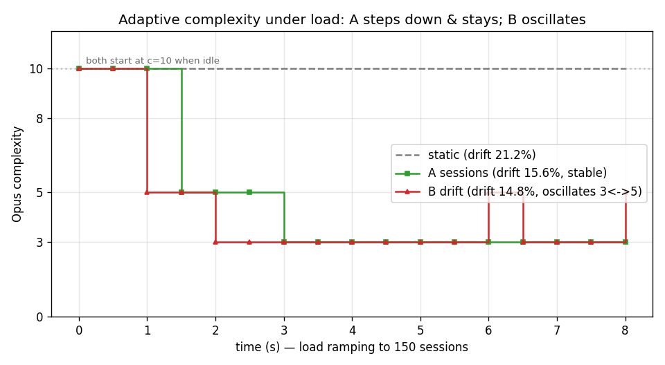

# Benchmarks & capacity

Durable record of the P5 measurement phase (2026-05-31 baseline). Captured on a
16-core box, 2026-05-31, **before** any P6 optimization, so it is the baseline
for before/after comparison.

## Opus micro-benchmark (the per-session CPU floor)

`internal/audio/opus_bench_test.go`. Raw baseline: [`opus-baseline.txt`](opus-baseline.txt)
(`-count=10`). Reproduce:

```
go test -run=^$ -bench=. -benchmem -count=10 ./internal/audio/ > new.txt
benchstat opus-baseline.txt new.txt   # compare after an optimization
```

| op | ns/op | per frame | B/op | allocs/op |
|---|---|---|---|---|
| Encode (outbound) | ~161k | **~161µs** | 1280 | 1 |
| Decode (inbound)  | ~18.4k | **~18µs** | 6144 | 1 |
| Roundtrip (1 session, 1 frame) | ~190k | **~190µs** | 7424 | 2 |

**Reading it:** 50 frames/s/direction. One full-duplex session ≈ `50 × 190µs`
= 9.5ms/s = **~0.95% of a core**, i.e. **~107 sessions/core** for Opus alone.
On 16 cores: pure-Opus ceiling ~1700, minus real-time headroom and
SRTP/DTLS/pion/GC ⇒ a realistic dedicated-box ceiling around **600–1000**.

Two facts that set the P6 agenda:
- **Encode dominates decode ~8.5×** — the outbound encode is the CPU hot spot.
  Pacing/scheduler tricks (timing wheel) do not touch it.
- **1–2 heap allocs per frame** — at thousands of sessions this is real GC
  pressure. **P6 target: reuse buffers to drive Encode/Decode to 0 allocs/op.**

## Capacity sweep (local, pessimistic)

[`capacity-local.csv`](capacity-local.csv) → `plot_capacity.py`. loadgen and
proxy on the **same box**, `?model=loopback`, `-sidechannel=off`.



| n | proxy CPU | frames ≥30ms | connected |
|---|---|---|---|
| 50  | ~3.3 cores | 2.6% (healthy) | 50/50 |
| 150 | ~7.5 cores | 27.8% (SLO broken) | 145/150 |
| 300 | ~7 cores | 40.4% (collapsed) | 236/300 |

The pacing SLO (target: <~5% of frames ≥30ms) breaks between n=50 and n=150
**here** — but this is pessimistic: loadgen's own pion clients steal CPU from
the proxy on the same machine, so scheduler starvation inflates the drift. The
gap to the computed ~600–1000 ceiling *is* the co-location tax.

> **For real numbers, run loadgen off-box.** The local sweep is only good for
> validating the method and watching the histogram move.

Also observed: pion spawns **~50–65 goroutines per peer connection** (n=300 ⇒
~17.8k goroutines proxy-side), a separate memory/scheduling scaling limit.

## P6 optimization: zero-alloc audio hot path

`Encoder`/`Decoder` reuse an internal buffer instead of allocating per frame
(bufio.Scanner-style; the returned slice is valid until the next call). Safe
because every consumer copies synchronously: providers resample into a new
slice, and pion's Opus payloader copies in `WriteSample`.

`benchstat opus-baseline.txt opus-p6.txt` (`-count=10`):



(regenerate: `python3 plot_p6_compare.py`)

| op | allocs/op | B/op | sec/op |
|---|---|---|---|
| Encode | 1 → **0** | 1.25Ki → **0** | ~ (no change) |
| Decode | 1 → **0** | 6Ki → **0** | **−4.6%** |
| Roundtrip | 2 → **0** | 7.25Ki → **0** | ~ (no change) |

Encode CPU is unchanged (buffer reuse doesn't touch compute) — that wall needs
Opus-complexity tuning (below). But at 5000 sessions this removes ~500k
allocs/s, cutting GC pressure that was itself feeding pacing jitter.

## Opus complexity — the encode-CPU lever

`BenchmarkEncodeComplexity` (rich signal):

| complexity | encode/frame | vs c=10 | sessions/core |
|---|---|---|---|
| 10 (default) | ~166µs | 1.0× | ~107 |
| 8 | ~170µs | ~same | — (8→10 is free) |
| 5 | ~79µs | **2.1× faster** | **~200** |
| 3 | ~60µs | 2.8× | ~270 |
| 0 | ~35µs | 4.7× | ~330 (audible loss) |

Lowering complexity is the only thing that moves the encode wall. c=5 ≈ halves
encode CPU and is usually transparent for 16kbps narrowband voice; 8→10 buys
nothing.

## Adaptive complexity (graceful load-shedding) — A/B

Complexity is live-adjustable (`-adaptive=sessions|drift`); a controller lowers
it under load and restores it when idle. A/B at a 150-session ramp:



| mode | behaviour | cumulative ≥30ms |
|---|---|---|
| static (default) | c≈10 throughout | 21.2% |
| **A `sessions`** (proactive) | starts at 10 (idle), steps 10→5→3 as count crosses 40/90, **stable** | 15.6% |
| B `drift` (reactive) | starts at 10, hits floor fast, then **oscillates (3↔5)** under sustained load | 14.8% |

Both protect pacing vs static. **A is the recommended default**: stable, no
quality flapping. B's reactive loop chases the SLO and oscillates (it raises
complexity back the moment pacing recovers, then re-overloads) — the same
feedback hazard as the reverted pacer. B is kept only as a labelled experiment.
