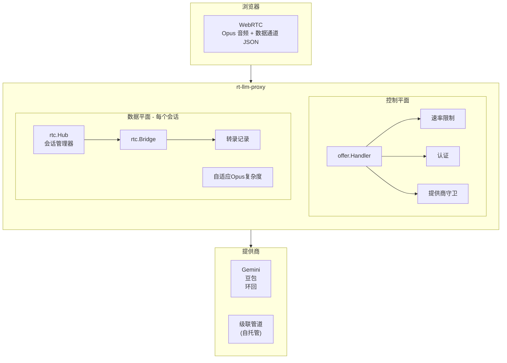

# rt-llm-proxy 中文指南

## 项目概述

**rt-llm-proxy** 是一个用 Go 编写的实时 LLM 代理服务。浏览器通过 **WebRTC** 连接，代理终止对等连接、解码 Opus 音频，并将其桥接到流式模型后端——支持托管 STS API（如 Gemini、豆包）或自托管级联管道（ASR → LLM → TTS）。

```
浏览器 ──WebRTC(Opus + 数据通道)──▶ 代理 ──▶ gemini / doubao (WebSocket PCM)
                                         └──▶ cascade (HTTP 阶段)
      ◀──────────── Opus 音频 ────────────
```

**关键特点：**
- 无 STUN/TURN/SFU 配置（仅主机候选）— 代理不是 NAT 穿透基础设施
- 可选的速率限制（仅在控制平面）
- 支持 Kafka 侧通道（用于转录事件）
- 可选的跨节点重连重放支持

---

## 快速开始

### 前置条件

- Go 1.25+
- libopus 开发库：
  ```bash
  sudo apt-get install -y libopus-dev libopusfile-dev pkg-config
  ```
- （可选）Redis 用于速率限制

### 运行本地代理

```bash
export GEMINI_API_KEY=...  # 或 GOOGLE_API_KEY
go run ./cmd/proxy -addr :8080
# 打开 http://localhost:8080/demo/
```

### Docker Compose

最简单的方式 — 仅代理（无 Redis、无 Kafka）：

```bash
cp .env.example .env    # 设置 GEMINI_API_KEY
docker compose up --build
# http://localhost:8080/demo/
```

---

## 提供商（Provider）支持

| 模型参数 | 提供商 | 状态 |
|---|---|---|
| `gemini` (默认) | Gemini Live (`BidiGenerateContent`) | 工作 |
| `doubao` | 豆包端到端实时语音 (Volcengine V3 WS) | 工作 |
| `cascade` | 自托管 ASR → LLM → TTS 管道 | 工作 |
| `loopback` | 假提供商（正弦波，无上游）— 仅负载测试 | 工作 |

---

## 架构概览

### 系统层次



### 核心模块

| 模块 | 位置 | 职责 |
|---|---|---|
| **Bridge** | `internal/rtc` | 终止浏览器 WebRTC 对等连接；双向泵送音频 + 数据通道 |
| **会话管理** | `internal/rtc` | 会话注册表和存档（用于重连） |
| **转录** | `internal/transcript` | `Recorder` 分配序列号、记录转录行 |
| **Offer 处理** | `internal/offer` | 控制平面链：速率限制 → 提供商守卫 → 重连重放 |
| **提供商守卫** | `internal/modelcb` | 按提供商的断路器 |
| **认证** | `internal/auth` | Bearer 令牌 → `user_id`（失败开放匿名） |
| **模型接口** | `internal/model` | 提供商不可知的 `Model` 接口 |
| **提供商适配器** | `internal/model/{gemini,doubao,cascade}` | 具体实现 |
| **级联** | `internal/model/cascade` | 进程内协调器 + 外部侧车 |
| **侧通道** | `internal/sidechannel` | 转录事件到 Kafka |
| **音频** | `internal/audio` | Opus 编解码 + 线性重采样 |
| **速率限制** | `internal/ratelimit` | Redis 固定窗口限制器 |

---

## 级联管道（Cascade）

### 什么是级联？

级联是一个自托管的 ASR → LLM → TTS 管道，运行在 GPU 主机上。通过 `?model=cascade` 参数选择。它实现相同的 `Model` 接口，所以 Bridge、转录记录、侧通道和重连机制都保持**不变**。

```
浏览器 ──WebRTC(Opus)──▶ 代理 ──┬── 协调器 (进程内)
                                ├──▶ RealtimeSTT (ASR 侧车)
                                ├──▶ vLLM (LLM 侧车)
                                ├──▶ XTTS (TTS 侧车)
                                └──▶ turndetect/ (可选)
      ◀──Opus────────── 代理 ◀── PCM 来自协调器
```

### 侧车组件

| 组件 | 位置 | 功能 |
|---|---|---|
| **ASR** | `realtimestt/` | Silero VAD + faster-whisper（部分、完整、说话开始检测） |
| **LLM** | vLLM | OpenAI 兼容 API，默认 Qwen3.5-9B |
| **TTS** | xtts-streaming-server | 流式 XTTS v2 |
| **转折检测** | `turndetect/` | 句子完成分类器（可选） |

### 两个业务接缝

级联暴露两个接缝，保持核心代理业务无关，同时支持下游用例（如个性化 DJ）：

**1. LLM 拦截接缝 — `Config.OnLLMToken`**

在令牌到达 TTS 前调用。返回 `("", false)` 通过，`(替代, true)` 替换，`("", true)` 静默丢弃。

```go
cascade.New(ctx, cascade.Config{
    OnLLMToken: func(token, accumulated string) (string, bool) {
        if id := detectSongIntent(accumulated + token); id != "" {
            go playTrack(id)       // 触发输出混合接缝
            return "", true        // 从 TTS 丢弃哨兵
        }
        return "", false
    },
})
```

**2. 输出混合接缝 — `Cascade.SetAudioSource`**

注入任何 `AudioSource` 到出站流。`Recv()` 从它读取直到 `io.EOF`，然后自动回退到 TTS。

```go
type AudioSource interface {
    Read() ([]int16, error) // 单声道 s16, 48kHz; 完成时返回 io.EOF
    Close() error
}

// 会话中切换到真实曲目：
c.SetAudioSource(NewMP3Source("track-42.mp3"))
```

### 低延迟设计

三个机制堆叠以减少首音频时间（TTFA）：

1. **推测性 LLM 启动** — RealtimeSTT 发出高频部分。当部分看起来像完整句子（稳定~200ms，以标点结尾）时，级联提交临时用户转折并在 ASR 最终到达前启动 LLM。如果最终匹配，生成继续；如果不匹配，推测被丢弃，新转折开始。

2. **句子分段流式 TTS** — `respond()` 在句子边界分割 LLM 令牌流，每个分段合成 LTS，LLM 继续生成下一个。通过 XTTS 流式，播放在句子完全渲染前开始。

3. **转折检测（可选）** — 当 `-cascade-turndetect` 设置时，侧车在每个 ASR 最终后建议暂停，减少对拖尾语音的过早回复。未设置时，LLM 在最终后立即启动。

### 抢断（Barge-in）

当 RealtimeSTT 信号 `speech_start`（用户开始说话）时，进行中的 LLM HTTP 流和 TTS 合成通过上下文取消。`bargeIn()` 等待 `respond()` 退出，然后排空缓冲音频 — 旧回复和新转折之间无竞态。

重复话语（Jaccard 令牌相似度 ≥ 0.9）被忽略。

---

## 配置标志

### 核心标志

| 标志 | 默认 | 说明 |
|---|---|---|
| `-addr` | `:8080` | 监听地址 |
| `-redis` | `` | Redis 地址（用于速率限制） |
| `-rl-max` | `10` | 每个客户端 IP 每个窗口最多会话数 |
| `-rl-window` | `1m` | 速率限制窗口 |
| `-sidechannel` | `off` | 转录侧通道：`off` \| `stdout` \| `kafka` |
| `-kafka` | `` | Kafka 种子代理（逗号分隔） |
| `-replay-url` | `` | 重放索引服务 URL（启用跨节点重连） |

### 级联特定标志

| 标志 | 默认 | 说明 |
|---|---|---|
| `-cascade-whisper` | `ws://localhost:9000/...` | RealtimeSTT WebSocket URL |
| `-cascade-llm` | `http://localhost:8000` | OpenAI 兼容 LLM 基础 URL（vLLM） |
| `-cascade-llm-model` | `Qwen3.5-9B` | vLLM 提供的模型名称 |
| `-cascade-tts` | `http://localhost:8020` | XTTS 流式服务器基础 URL |
| `-cascade-tts-speaker` | `` | XTTS 播音员（空 = 第一个可用） |
| `-cascade-tts-lang` | `en` | XTTS 语言代码（`en`、`zh-cn`、…） |
| `-cascade-turndetect` | `` | 转折检测侧车 URL（空 = ASR 最终后立即启动 LLM） |
| `-cascade-system` | `You are a helpful voice assistant.` | 级联 LLM 系统提示 |

### Opus 调整

| 标志 | 默认 | 说明 |
|---|---|---|
| `-opus-complexity` | `-1` | Opus 编码器复杂度 0–10（-1 = libopus 默认；越低 CPU 越少） |
| `-adaptive` | `off` | 负载下自适应复杂度：`off` \| `sessions`（推荐）\| `drift`（反应性，可能振荡） |

### 提供商守卫

| 标志 | 默认 | 说明 |
|---|---|---|
| `-model-cb` | `true` | 断路器模型连接尝试（`gemini` / `doubao`） |
| `-model-cb-open-after` | `5` | 打开断路器前的瞬态失败次数 |
| `-model-cb-open-for` | `30s` | 瞬态失败的打开持续时间 |
| `-model-cb-auth-open-for` | `5m` | 认证失败（401/403）的打开持续时间 |

---

## 故障转移和缩放

### 为什么难以水平扩展

实时会话有强**状态亲和力**：WebRTC/WebSocket 连接在一个 Pod 的内核文件描述符中，状态（pion 对等连接、提供商 WebSocket、转录上下文、编码器、抖动缓冲区）在 Pod 内存中。**另一个 Pod 无法继承 fd**，所以无缝连接迁移（L4）不切实际。

### 故障转移级别

| 级别 | 目标 | 此处状态 |
|---|---|---|
| L1 | 服务器死亡 → 客户端重连 | 可达一次复制 |
| L2 | 重连恢复**会话** | 基本实现 — 演示客户端发送 `X-Session-ID` + `X-Last-Seq` |
| L3 | 重连恢复**进度** | 部分 — 同节点重放在内存；跨节点重放使用重放索引服务 |
| L4 | 近无缝连接迁移 | 不切实际（fd/媒体亲和力） |

### 生产建议

对于生产规模，在成熟媒体层前面：**coturn**（TURN）用于可达性，以及 **SFU / 实时代理框架**（LiveKit、Pipecat）用于水平扩展、会话路由和重连。

---

## 环境变量

### Gemini

- `GEMINI_API_KEY` 或 `GOOGLE_API_KEY`
- `GEMINI_MODEL`（可选，默认 `models/gemini-3.1-flash-live-preview`）

### 豆包

- `DOUBAO_APP_ID`
- `DOUBAO_ACCESS_TOKEN`
- `DOUBAO_BOT_NAME`（可选）

### 配置文件（Provider 行为）

Provider 的**行为**（人设、音色、ASR 调优）通过可选的 YAML 文件配置，默认从
`proxy.yaml` 加载（用 `-config 路径` 覆盖；文件不存在则跳过）。**凭证和基础设施
参数不在此文件中**——密钥放 `.env`，基础设施用 CLI flag。复制模板开始：

```bash
cp proxy.yaml.example proxy.yaml
```

优先级：显式设置的 CLI flag > 配置文件 > 内置默认值。下列 provider 行为字段没有
对应 flag，配置文件是它们的唯一来源：

| 区块 | 字段 | 作用 |
|---|---|---|
| `gemini` | `system_prompt` | Live `systemInstruction`（无需消耗对话轮次的人设） |
| `gemini` | `tools` | function calling 工具声明（name/description/JSON-Schema parameters） |
| `doubao` | `model` | 端到端模型版本，API 必传（`1.2.1.1` O2.0 / `2.2.0.0` SC2.0；默认 `1.2.1.1`） |
| `doubao` | `system_role`、`speaking_style` | 人设 / 口吻（O 系列） |
| `doubao` | `voice` | `tts.speaker` 音色 ID |
| `doubao` | `asr.twopass`、`asr.end_smooth_ms`、`asr.hotwords` | ASR 准确率调优（热词需 `twopass: true`） |
| `cascade` | `system_prompt`、`tts_speaker`、`tts_lang`、`llm_model` | 当对应 `-cascade-*` flag 未设置时覆盖之 |

**工具调用（Gemini Live 3.1）**：在 `gemini.tools` 下声明工具，代理把它们声明给模型并保持业务中立。模型调用工具时，代理通过 data channel 把 `{"type":"tool_call","id","name","args"}` 转发给浏览器；浏览器执行函数后回 `{"type":"tool_result","id","name","response"}`，代理再交回模型。demo 自带 `get_weather` 桩。（Doubao 直连协议无原生 function calling，只有 RTC-room「混合编排」路径支持，本代理不走那条。）

**每会话听众简报**：offer 请求可带 `X-Listener-Brief` 头（UTF-8 文本的 base64）。它只对该会话追加到 provider 的系统提示，**作为 system instruction 注入、绝不作为对话 turn**，因此不会绕回 transcript 形成反馈环。用于上游编排层注入每用户记忆（如"这位听众爱周杰伦、在备考"）；全局人设留在 `proxy.yaml`，每用户简报走这个头。best-effort 解码（坏/超长头则忽略），上限 8 KiB。注意：简报来自被信任的调用方——生产环境 offer 端点必须只对编排层开放、不对浏览器开放（当前尚未锁定）。

---

## Docker Compose 叠加层

使用 `-f` 模式添加可选功能：

```bash
# Redis 速率限制
docker compose -f docker-compose.yml -f docker-compose.redis.yml up --build

# Kafka 侧通道
docker compose -f docker-compose.yml -f docker-compose.kafka.yml up --build

# 两者都有
docker compose -f docker-compose.yml -f docker-compose.redis-kafka.yml up --build

# 完整级联堆栈（需要 NVIDIA GPU）
export PUBLIC_IP=<主机>
docker compose -f docker-compose.yml -f docker-compose.cascade.yml up --build
# http://<PUBLIC_IP>:8080/demo/?model=cascade
```

---

## 项目布局

```
cmd/proxy/              HTTP 入口点、提供商路由、速率限制、管理
cmd/loadgen/            pion 负载生成器（用于容量测试）
cmd/replay/             重放索引：Kafka 消费者 + 重连查询 API
internal/rtc/           pion WebRTC 网桥 + 会话注册表
internal/model/         Model 接缝（仅接口）
internal/model/gemini/  Gemini Live 适配器
internal/model/doubao/  豆包实时对话适配器
internal/model/cascade/ ASR → LLM → TTS 级联管道
internal/audio/         Opus 编解码 + 线性重采样
internal/auth/          认证接缝（Bearer → user_id）
internal/sidechannel/   转录分接到 Kafka
internal/ratelimit/     Redis 固定窗口限制器
internal/adaptive/      自适应 Opus 复杂度控制
internal/metrics/       帧间隔直方图（步调 SLO）
demo/                   最小浏览器客户端
docs/                   架构和工程笔记
```

---

## 音频规约（关键）

**跨越 Model 接缝的每个音频块都是单声道有符号 16 位 PCM，采样率 48kHz**（WebRTC 的本地 Opus 采样率）。

提供商在内部转换为/来自自己的格式，所以 Bridge 永远不知道提供商的传输格式。这个单一规范格式是保持 Bridge 完全提供商不可知的原因。

---

## 技术优化

### 实时出站步调（无时钟漂移）

使用**单个会话级 `time.Ticker`**，而不是每帧 `time.After`。

- 为什么：`time.After` 在编码 + `WriteSample` 工作后启动其 20ms，所以每帧的实际周期是 `20ms + 编码`。这比实时慢，所以缓冲区备份，端到端延迟随响应长度单调增长。
- Ticker 解决：Ticker 在固定壁钟上触发；编码时间被吸收到 20ms 中而不是添加在顶部 → 零漂移。

### 原子速率限制 + 失败开放

- 通过 Lua 脚本的原子 `INCR+EXPIRE`。
- Redis 错误时允许（日志记录）而不是拒绝。

### Redis 仅在控制平面

Redis 仅触及 SDP Offer 端点。媒体路径（Opus ↔ PCM ↔ 提供商）从不进行网络往返到 Redis。

### Opus 调整（丢失/安静链接）

- **上行**：`minptime=10;useinbandfec=1;usedtx=1;maxaveragebitrate=16000`
- **下行**：20ms 帧（960 样本 @ 48kHz），带带外 FEC + DTX，`PacketLossPerc=10`

---

## 已知限制

- **重采样是线性插值**。适合我们的整数比率（48k↔16k、24k→48k）。
- **Gemini WS 字段名称对版本敏感**。
- **豆包** 使用 Volcengine V3 二进制帧；上游 PCM 16kHz，下游 TTS 24kHz。
- **速率限制失败开放**。Redis 不可达时允许会话（日志错误）。

---

## 进一步阅读

- [架构与工程笔记](ARCHITECTURE.md) — 每个非显而易见决策的深度解析
- [基准测试](bench/README.md) — Opus 基准、容量扫描、P6 优化
- [域语汇](../CONTEXT.md) — 关键术语定义

