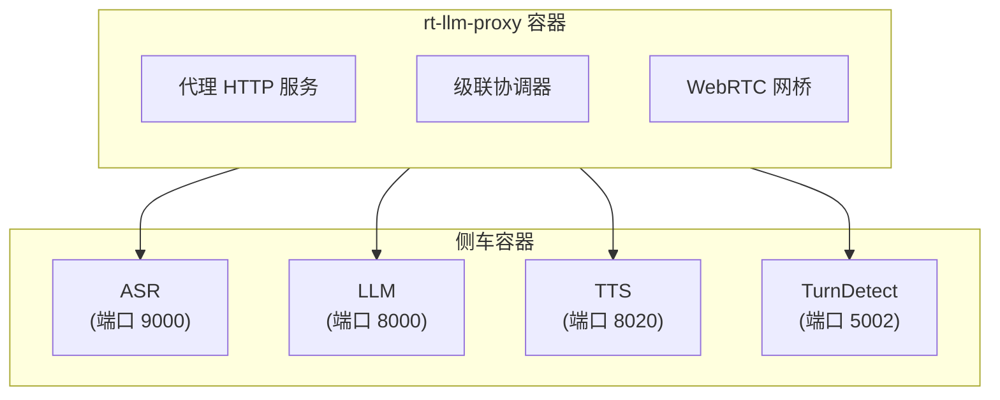

# rt-llm-proxy 中文部署指南

## 本地开发环境

### 1. 环境准备

#### 系统依赖

```bash
# Ubuntu/Debian
sudo apt-get update
sudo apt-get install -y libopus-dev libopusfile-dev pkg-config git golang-go

# macOS
brew install opus libopusfile pkg-config go
```

#### Go 版本检查

```bash
go version  # 需要 1.25+
```

#### 配置 Go 代理（中国用户）

```bash
go env -w GOPROXY=https://goproxy.cn,direct
```

### 2. 获取 API 密钥

#### Gemini (Google)

1. 访问 [Google AI Studio](https://aistudio.google.com/app/apikeys)
2. 点击"Create API Key"
3. 复制密钥到 `.env` 文件：
   ```
   GEMINI_API_KEY=your_key_here
   ```

#### 豆包 (Volcengine)

1. 登录 [Volcengine 控制台](https://console.volcengine.com)
2. 获取 `DOUBAO_APP_ID` 和 `DOUBAO_ACCESS_TOKEN`
3. 设置环境变量：
   ```bash
   export DOUBAO_APP_ID=your_app_id
   export DOUBAO_ACCESS_TOKEN=your_token
   ```

### 3. 本地运行

#### 最简单的方式（Gemini）

```bash
# 克隆仓库
git clone <repo>
cd rt_llm_proxy

# 设置 API 密钥
export GEMINI_API_KEY=your_key_here

# 运行代理
go run ./cmd/proxy -addr :8080

# 在浏览器打开
# http://localhost:8080/demo/
```

#### 选项：测试负载（无上游）

```bash
go run ./cmd/proxy -addr :8080 ?model=loopback
# http://localhost:8080/demo/?model=loopback
```

#### 调试模式

```bash
# 启用管理端点（pprof + 统计）
go run ./cmd/proxy -addr :8080 -admin :6060
# http://localhost:6060/debug/pprof/
# http://localhost:6060/stats  (JSON)
```

---

## Docker Compose 部署

### 基础堆栈（仅代理）

```bash
# 1. 复制环境配置
cp .env.example .env

# 2. 编辑 .env，设置 API 密钥
vim .env
# GEMINI_API_KEY=your_key_here

# 3. 启动容器
docker compose up --build

# 4. 访问演示
# http://localhost:8080/demo/
```

### 带 Redis 的部署（速率限制）

```bash
docker compose -f docker-compose.yml \
               -f docker-compose.redis.yml \
               up --build

# 现在启用速率限制
# -rl-max 10 （每个 IP 每分钟最多 10 个新会话）
```

### 带 Kafka 的部署（转录侧通道）

```bash
docker compose -f docker-compose.yml \
               -f docker-compose.kafka.yml \
               up --build

# 转录事件发送到 Kafka 主题 "transcripts"
```

### 完整堆栈（Redis + Kafka）

```bash
docker compose -f docker-compose.yml \
               -f docker-compose.redis-kafka.yml \
               up --build
```

### 级联部署（自托管 ASR/LLM/TTS）

#### 前置条件

- **NVIDIA GPU**（推荐 L20 24GB VRAM）
- **公网 IP**（用于 WebRTC 连接）

#### 部署步骤

```bash
# 1. 设置公网 IP
export PUBLIC_IP=your.public.ip

# 2. （可选）指定 Qwen 模型路径
export QWEN_MODEL_PATH=/path/to/Qwen3.5-9B

# 3. 启动完整堆栈
docker compose -f docker-compose.yml \
               -f docker-compose.cascade.yml \
               up --build

# 4. 访问级联演示
# http://<PUBLIC_IP>:8080/demo/?model=cascade
```

#### 开放端口

在主机安全组中打开：
- **TCP 8080** — HTTP（代理）
- **UDP 10000–60000** — WebRTC（媒体）

ASR/LLM/TTS/turndetect 保持在内部 Docker 网络上。

#### 容器组成



#### 级联特定环境变量

在 `.env` 中添加：

```bash
# ASR
CASCADE_WHISPER_URL=ws://realtimestt:9000/realtime

# LLM
CASCADE_LLM_URL=http://vllm:8000
CASCADE_LLM_MODEL=Qwen3.5-9B

# TTS
CASCADE_TTS_URL=http://xtts:8020
CASCADE_TTS_SPEAKER=default
CASCADE_TTS_LANG=en

# 系统提示
CASCADE_SYSTEM_PROMPT="You are a helpful voice assistant."
```

---

## 中国用户特殊说明

### Go 依赖加速

#### 方法 1：环境变量（推荐）

```bash
export GOPROXY=https://goproxy.cn,direct
export GOSUMDB=off  # 如果访问 sum.golang.org 超时
```

#### 方法 2：Docker 中国镜像

```bash
docker compose -f docker-compose.yml \
               -f docker-compose.cn.yml \
               up --build
```

或在 `.env` 中：

```bash
GOPROXY=https://goproxy.cn,direct
```

### GPU 支持（Volcano 引擎）

如果在 Volcano 引擎上部署级联：

1. 确认 GPU 型号（推荐 L20）
2. 预加载模型权重（避免运行时从 HuggingFace 下载）：
   ```bash
   export QWEN_MODEL_PATH=/path/to/Qwen3.5-9B
   export XTTS_MODEL_PATH=/path/to/xtts-v2
   ```

---

## 速率限制配置

### 使用 Redis 的固定窗口限制

```bash
go run ./cmd/proxy \
  -redis localhost:6379 \
  -rl-max 10 \
  -rl-window 1m \
  -addr :8080
```

| 参数 | 说明 |
|---|---|
| `-redis` | Redis 服务器地址 |
| `-rl-max` | 每个客户端 IP 每个窗口的最大会话数 |
| `-rl-window` | 窗口时长（如 `1m`、`10s`） |

### 失败开放策略

如果 Redis 不可达，代理**允许请求**并记录错误。这保证了 Redis 故障不会中断服务。

---

## 监控和调试

### 管理端点

启用：

```bash
go run ./cmd/proxy -admin :6060
```

#### 统计信息

```bash
curl http://localhost:6060/stats | jq
```

返回 JSON：

```json
{
  "sessions": 5,
  "frames_total": 125000,
  "frames_late_30ms": 150,
  "bytes_in": 1024000,
  "bytes_out": 2048000
}
```

#### pprof 分析

```bash
# CPU 分析
go tool pprof http://localhost:6060/debug/pprof/profile?seconds=30

# 内存分析
go tool pprof http://localhost:6060/debug/pprof/heap

# Goroutine 分析
curl http://localhost:6060/debug/pprof/goroutine?debug=1
```

### 日志

#### 标准输出

代理日志输出到 stdout。在 Docker 中查看：

```bash
docker compose logs -f rt-llm-proxy
```

#### 侧通道转录

如果启用了 Kafka：

```bash
# 消费转录主题
docker compose exec kafka kafka-console-consumer.sh \
  --bootstrap-server localhost:9092 \
  --topic transcripts \
  --from-beginning
```

---

## 性能基准

### Opus 基准（单会话 CPU）

| 操作 | 时间/操作 | 每帧时间 |
|---|---|---|
| 编码（出站） | ~161µs | ~161µs |
| 解码（入站） | ~18.4µs | ~18µs |
| 往返 | ~190µs | ~190µs |

**理论上限**：
- 单核最多 ~107 个会话（仅 Opus）
- 16 核最多 ~600–1000 个会话（考虑 SRTP/DTLS/pion/GC 开销）

### 自适应复杂度

在高负载下降低 Opus 编码器复杂度以保持步调 SLO（<5% 帧 ≥30ms 延迟）：

```bash
# 推荐（主动）
go run ./cmd/proxy -adaptive sessions

# 反应式（可能振荡）
go run ./cmd/proxy -adaptive drift
```

---

## 故障排查

### 问题：WebRTC 连接失败

**症状**：演示页面显示 "Failed to connect"

**排查**：

1. 检查防火墙：
   ```bash
   # 开放 UDP 10000-60000
   sudo ufw allow 10000:60000/udp
   ```

2. 检查代理运行：
   ```bash
   curl http://localhost:8080/stats
   ```

3. 检查日志：
   ```bash
   docker compose logs rt-llm-proxy | tail -20
   ```

### 问题：高延迟或卡顿

**症状**：音频播放滞后，帧丢失多

**排查**：

1. 检查 CPU 使用率：
   ```bash
   # 在管理端点查看
   curl http://localhost:6060/stats | jq '.frames_late_30ms'
   ```

2. 启用自适应复杂度：
   ```bash
   go run ./cmd/proxy -adaptive sessions
   ```

3. 查看 Opus 配置：
   ```bash
   # 降低复杂度
   go run ./cmd/proxy -opus-complexity 5
   ```

### 问题：Kafka 事件未发送

**症状**：转录不出现在 Kafka

**排查**：

1. 检查 Kafka 连接：
   ```bash
   docker compose exec kafka kafka-broker-api-versions.sh \
     --bootstrap-server localhost:9092
   ```

2. 检查主题：
   ```bash
   docker compose exec kafka kafka-topics.sh \
     --list --bootstrap-server localhost:9092
   ```

3. 检查侧通道状态：
   ```bash
   curl http://localhost:6060/stats | jq '.sidechannel'
   ```

### 问题：级联（自托管）无法连接到侧车

**症状**：`?model=cascade` 返回 502 错误

**排查**：

1. 检查侧车健康：
   ```bash
   docker compose ps  # 查看所有容器状态
   ```

2. 检查网络：
   ```bash
   docker network inspect rt_llm_proxy_default
   ```

3. 检查侧车日志：
   ```bash
   docker compose logs realtimestt
   docker compose logs vllm
   docker compose logs xtts
   ```

4. 验证 URL：
   ```bash
   docker compose exec rt-llm-proxy \
     curl http://realtimestt:9000/health
   ```

---

## 生产建议

### 1. 前置托管媒体层

使用 **coturn**（TURN 中继）和 **SFU / LiveKit** 获得：
- NAT 穿透
- 水平扩展
- 会话路由
- 完整故障转移

### 2. 监控和告警

- 设置 Prometheus 抓取 `/stats` 端点
- 告警：帧延迟 > 5% 超过 ≥30ms，会话连接失败率

### 3. 日志聚合

使用 ELK / Loki 聚合：
- 标准输出日志
- 转录事件（从 Kafka）
- 管理端点指标

### 4. 备份和恢复

- Kafka 侧通道提供转录持久性
- 使用 `-replay-url` 启用跨节点重连
- 部署多个代理，前置 TURN + SFU

### 5. 安全考虑

- 启用 Redis ACL（如果使用 `-redis`）
- 在反向代理后验证 Bearer 令牌
- 限制 `-admin` 端点访问（如 `:6060` 绑定到 localhost）

---

## 相关文档

- [快速开始](../README.md#quick-start)
- [架构详解](ARCHITECTURE.md)
- [性能基准](bench/README.md)

